---
## Front matter
lang: ru-RU
title: Первый этап проекта. Операционные системы.
author: |
	Сячинвоа Ксения Ивановна НПМбд-02-21
institute: |
	Российский Университет дружбы народов

## Formatting
toc: false
slide_level: 2
theme: metropolis
header-includes: 
 - \metroset{progressbar=frametitle,sectionpage=progressbar,numbering=fraction}
 - '\makeatletter'
 - '\beamer@ignorenonframefalse'
 - '\makeatother'
aspectratio: 43
section-titles: true
---

## Цель работы
Размещение на Github pages заготовки для персонального сайта.

## Задание

- Установить необходимое программное обеспечение.
- Скачать шаблон темы сайта.
- Разместить его на хостинге git.
- Установить параметр для URLs сайта.
- Разместить заготовку сайта на Github pages.

## Выполнение лабораторной работы
1. Скачиваем исполняемый файл Hugo для генерации страниц сайта.Переходим по ссылке и скачиваем последнюю версию сайта. Для работы в компьютерном классе на нашу операционную истему  мы вибираем файл
`hugo_extended_0.98.0_Linux-64bit.tar.gz `.(рис. [-@fig:001])(рис. [-@fig:002])

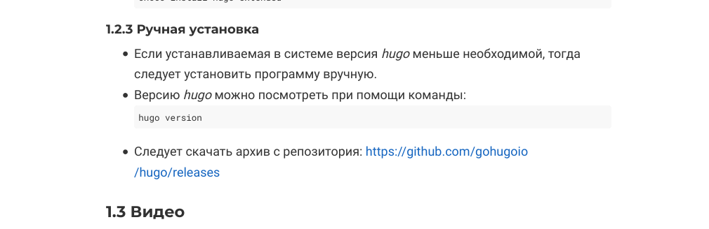{ #fig:001 width=30% }

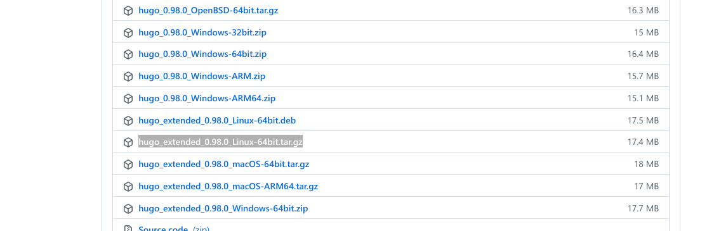{ #fig:002 width=30% }

## 

2. Затем извлекаем текущую папку из архива. Вырезаем исполняемый файл hugo в папку bin, предварительно создав её в домашней папке. Затем переходим в Konsole.

3. Далее сделаем клон репозитория. Для этого сначала создаём его, я назвала мой репозиторий "Project". После этого копируем ссылку и с помощью команды `git clone --recursive` создаём копию.(рис. [-@fig:003])

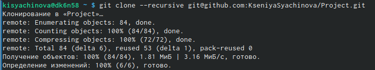{ #fig:003 width=50% } 

##

4. Переходим в "Prijects". С помощью команды `ls -l` видим наши файлы. После этого выполняем команду ~/big/hugo обязательно ставим знак тильды, так как мы переходим в каталог пользователя. Удалим папку public для упрощения работы.(рис. [-@fig:004])

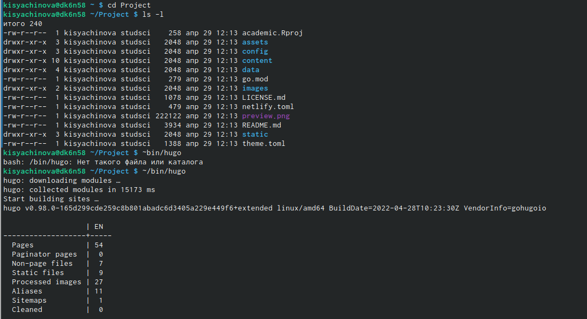{ #fig:004 width=70% }

##

5. Используем команду ~/bin/hugo server и при правильном выполнении мы видим ссылку на наш сайт. Копируем и вставляем в браузер. При выполнении данной команды мы автоматически создали файлы. Этот сайт виден только нам. (рис. [-@fig:005])

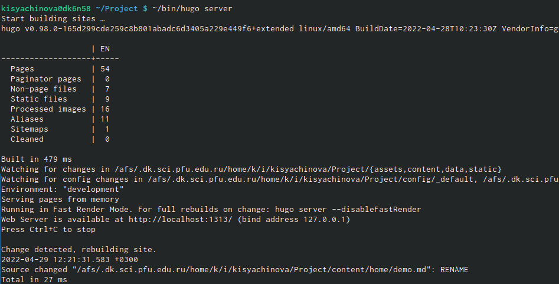{ #fig:005 width=70% }

##

6. Уберём зелёное поле, которое сейчас находится на нашем сайте. Для этого нужно удалить одну папку. Пусть к этой папке прописан на сайте: `content/home/demo.mg`. После удаления видим исчёзновение зеленого фона. (рис. [-@fig:006]), (рис. [-@fig:007])

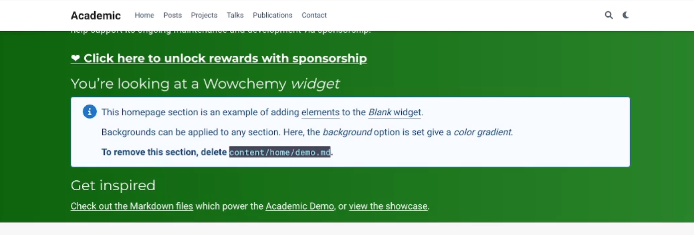{ #fig:006 width=70% }

##

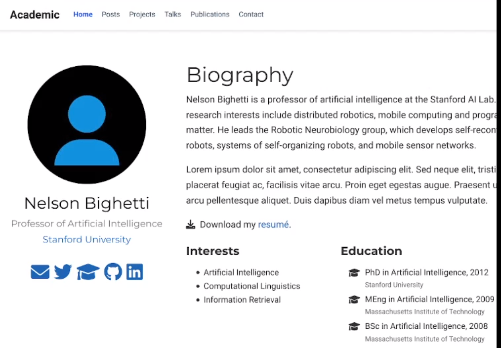{ #fig:007 width=70% }

##

7. Теперь переносим сайт на репозиторий. Для этого создаём ещё один репозиторий с определённым именем. В моём случае это `KseniyaSyachinova.github.io` (рис. [-@fig:008])

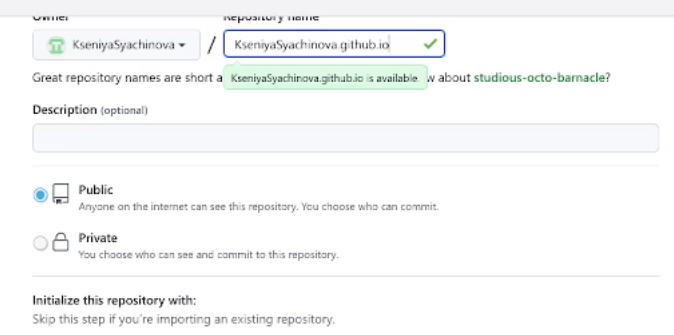{ #fig:008 width=70% }

##

8. После создания репозитория переходим в консоль, поднимаемся на уровень выше и рядом с ним клонируем наш созданный репозиторий. Проверяем с помощью команды `ls`.(рис. [-@fig:009])

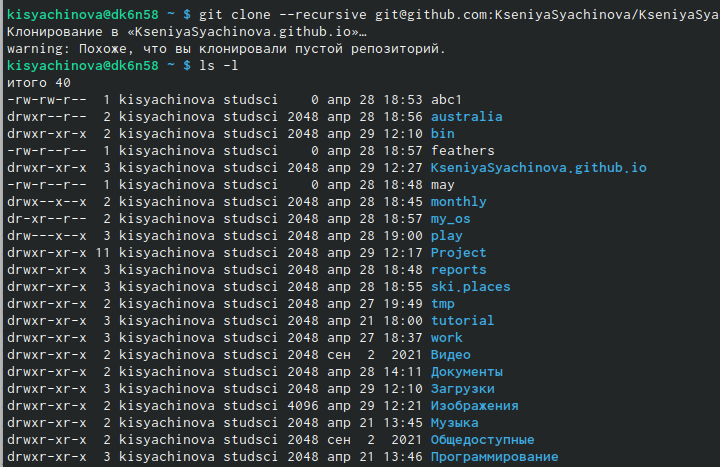{ #fig:009 width=70% }

##

9. Переходим в репозиторий, создаёт ветку main с помощью команды `git checkout -b main`, создаём пустой файл для активации репозитория, добовляем его с помощью знакомых действий.(рис. [-@fig:010])

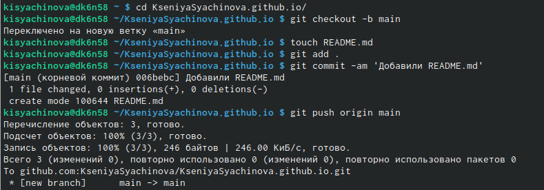{ #fig:010 width=50% }

##

10. Переходим в наш Project и теперь подключаем репозиторий к папке public внутри нашего блока для эффективной регенирации страниц нашего сайта. Для этого используем команду `git submodule add -b main git@github.com:KseniyaSyachinova/KseniyaSyachinova.github.io.git public`. Подключаем обратно наш publiс. Комментируем его #public и проверяем. Опять используем нашу команду и видим изменения. рис. [-@fig:011])

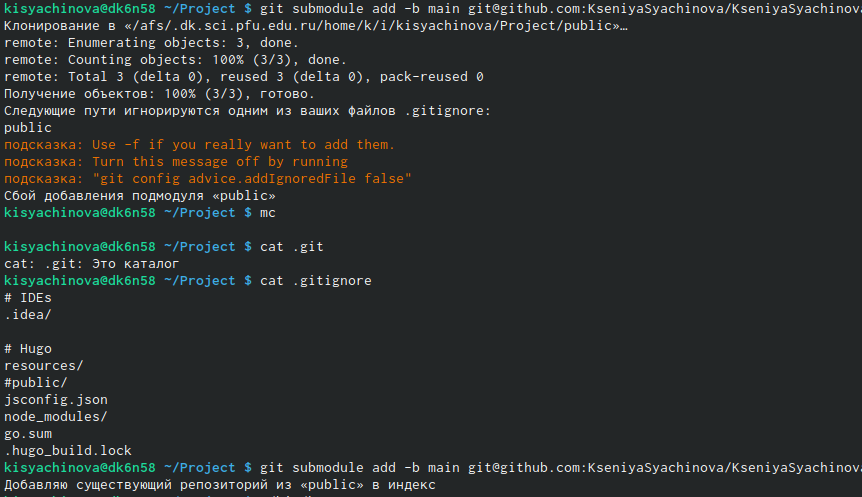{ #fig:011 width=70% }

##

11. С помощью ~/bin/hugo мы автоматически добавляем файлы в нашу папку, которые в будущем будут являтся файлами нашего сайта.(рис. [-@fig:012])

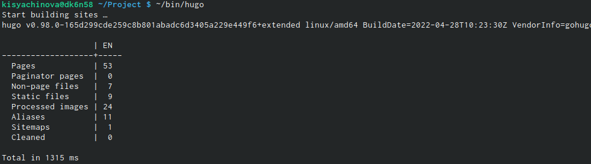{ #fig:012 width=45% }

##

12. Синхронизируем эти файлы с репозиторием. Возвращаемся в public, для проверки делаем `git remote -v`. (рис. [-@fig:013]), (рис. [-@fig:014]), 

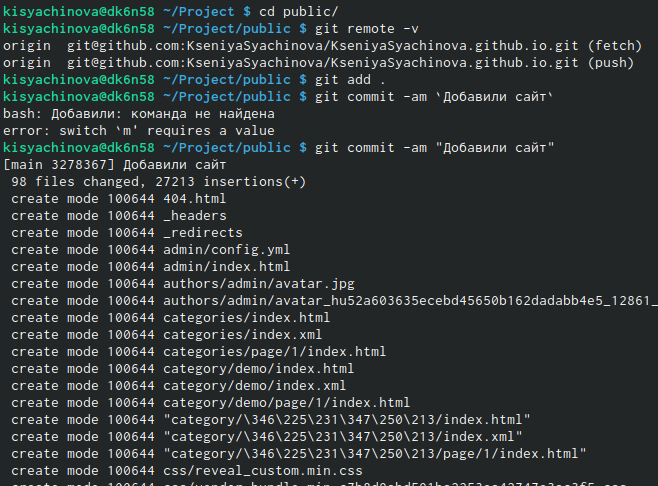{ #fig:013 width=70% }

##

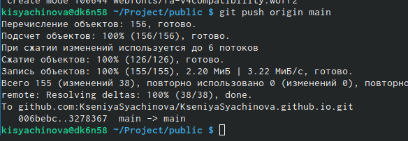{ #fig:014 width=70% }

##

13. Обовляем наш репозиторий и видим все файлы. Копируем ссылку, вставляем в браузер и видим наш новый сайт. На это первый этап закончен. (рис. [-@fig:015]), (рис. [-@fig:016]), 

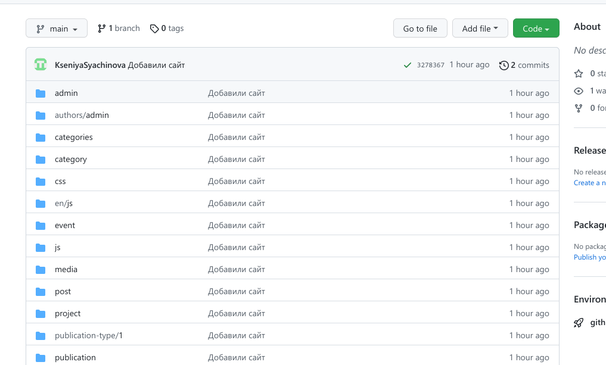{ #fig:015 width=50% }

##

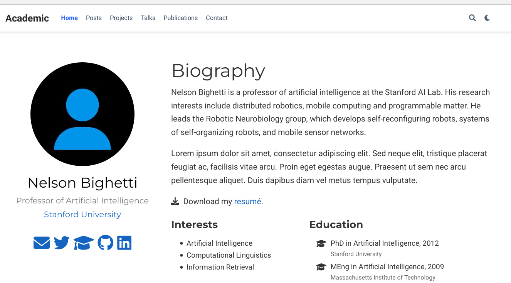{ #fig:016 width=50% }

# Выводы
После выполнения первго этапа проекта я научилась: 

- Устанавливать необходимое программное обеспечение.
- Скачивать шаблон темы сайта.
- Размещать его на хостинге git.
- Установливать параметр для URLs сайта.
- Размещать заготовку сайта на Github pages.
