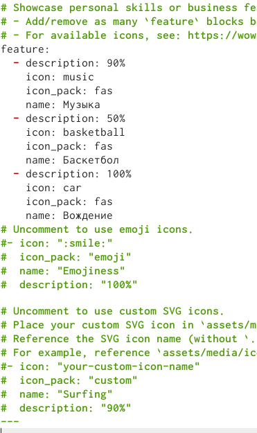
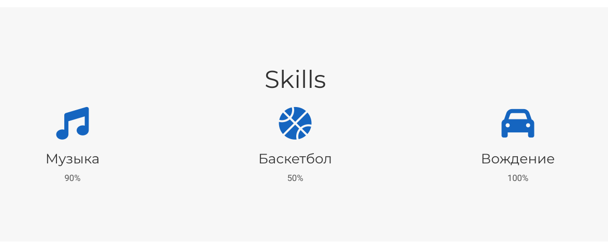
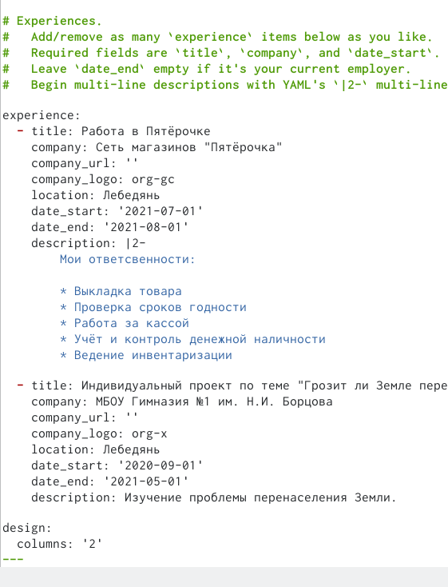
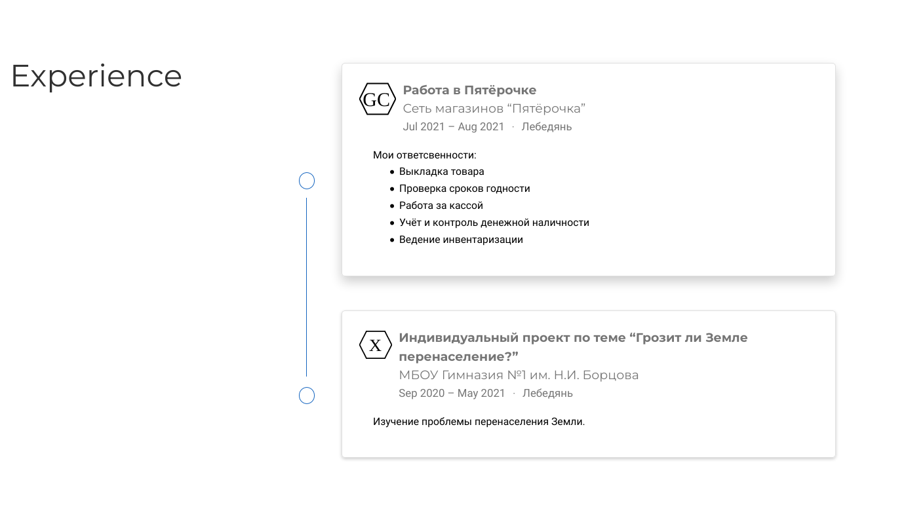
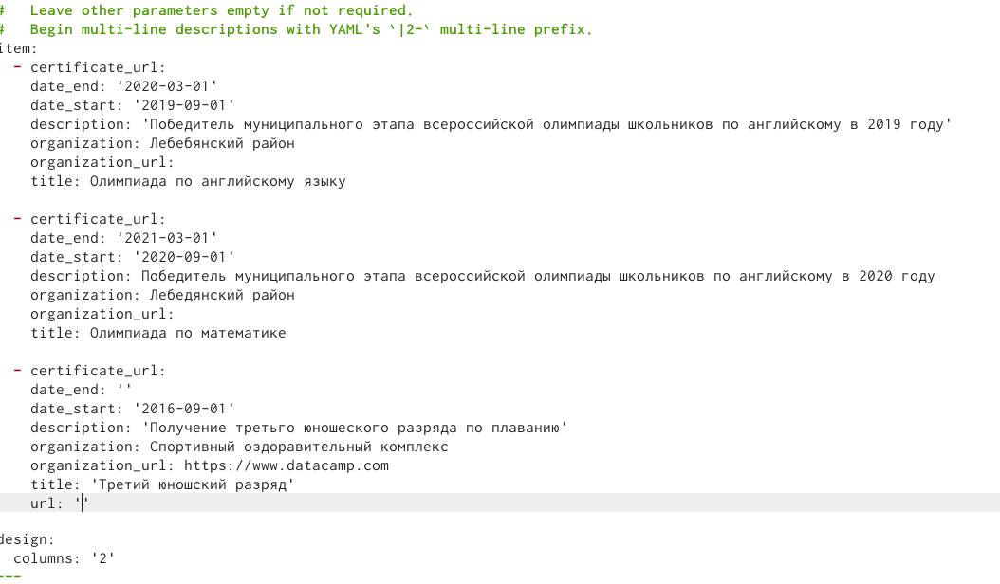
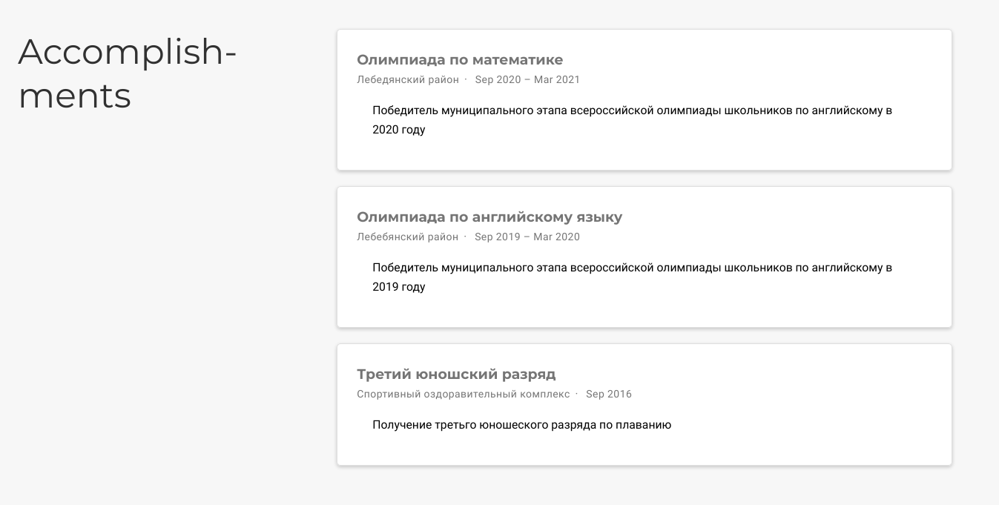
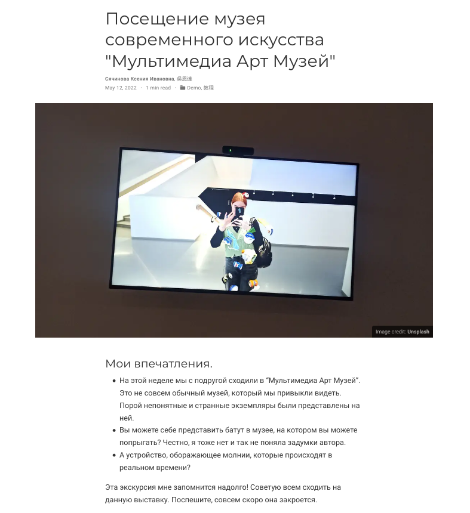
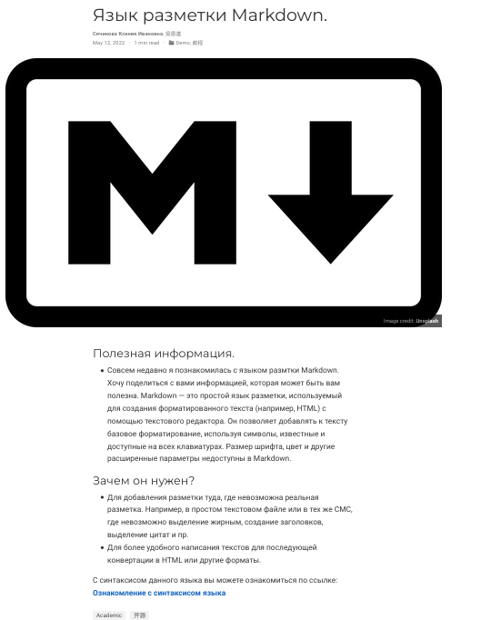

---
## Front matter
lang: ru-RU
title: Презентация по третьему этапу индивидуального проекта
author: |
	Сячинова Ксения Ивановна, НПМбд-02-21
institute: |
	Российский университет дружбы народов

## Formatting
toc: false
slide_level: 2
theme: metropolis
header-includes: 
 - \metroset{progressbar=frametitle,sectionpage=progressbar,numbering=fraction}
 - '\makeatletter'
 - '\beamer@ignorenonframefalse'
 - '\makeatother'
aspectratio: 43
section-titles: true
---

## Задание

- Добавить информацию о навыках (Skills).
- Добавить информацию об опыте (Experience).
- Добавить информацию о достижениях (Accomplishments).
- Сделать пост по прошедшей неделе.
- Добавить пост на тему по выбору:
   - Легковесные языки разметки.
   - Языки разметки. LaTeX.
   - Язык разметки Markdown

## Выполнение лабораторной работы
1. Добавляем информация о навыках. Для этого переходим в папку Ptoject/contet/home и открываем skills.md. Меняем информацию под себя и получаем нужный вариант. Для добавления иконок переходим по ссылке  и выбираем необходимые иконки: (https://wowchemy.com/docs/page-builder/#icons) (рис. [-@fig:001]),(рис. [-@fig:002])

{ #fig:001 width=25% }

##

{ #fig:002 width=50% }

##

2. Аналогично в этой же папке открываем файл experience.md и изменяем информацию. (рис. [-@fig:003]),(рис. [-@fig:004])

{ #fig:003 width=25% }

##

{ #fig:004 width=50% }

##

3. Добавляем информацию о достижениях. Переходим в файл accomplishments.md, изменяем файл. (рис. [-@fig:005]),(рис. [-@fig:006])

{ #fig:005 width=25% }

##

{ #fig:006 width=40% }

##

4. Затем сделала новый пост по прошедшей неделе. Создала новую папку для поста, добавила фото и описание.(рис. [-@fig:007])

{ #fig:007 width=30% }

##

5. Добавила пост на тему: язык разметки Markdown.(рис. [-@fig:008])

{ #fig:008 width=30% }

##

6. Выгружаем всё на github и запускаем наш сайт с помощью команды "~/bin/hugo"

## Выводы

При выполнении третьего этапа индивидуального проекта я научилась изменять информацию в определённых файлах, отработала навык создания постов.

