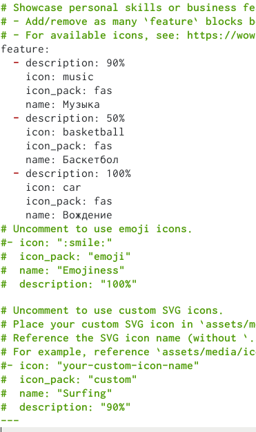
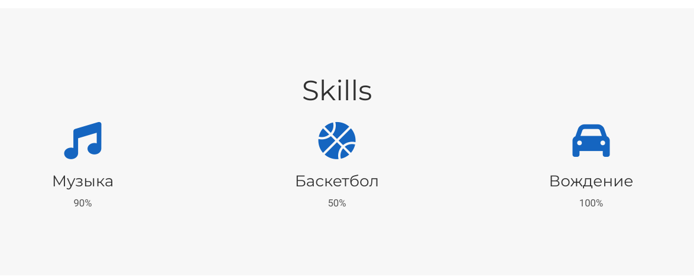
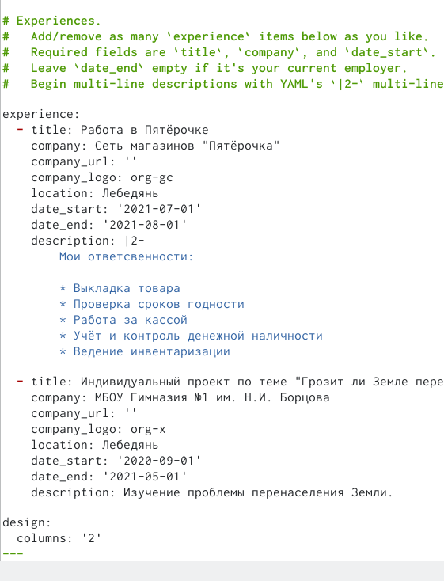
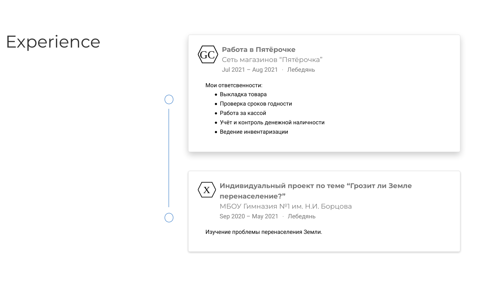
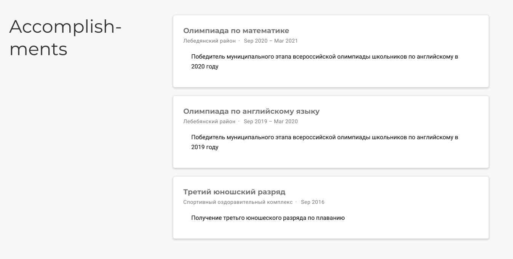
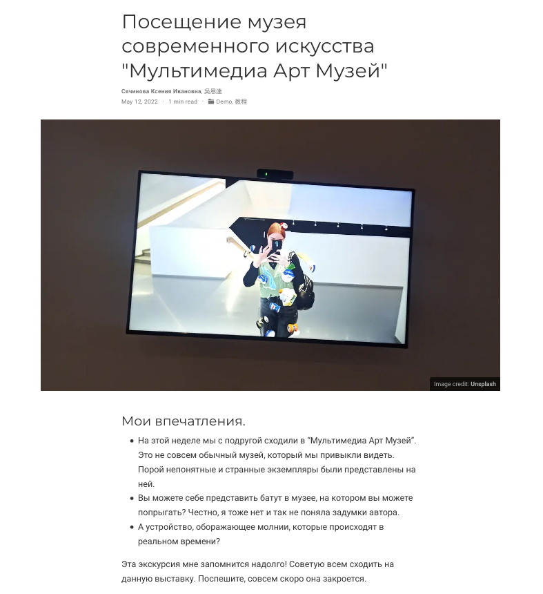
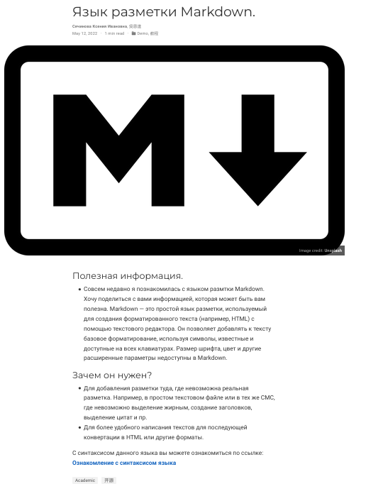

---
## Front matter
title: "Третий этап индивидуального проекта"
subtitle: "Операционные системы"
author: "Сячинвоа Ксения Ивановна"

## Generic otions
lang: ru-RU
toc-title: "Содержание"

## Bibliography
bibliography: bib/cite.bib
csl: pandoc/csl/gost-r-7-0-5-2008-numeric.csl

## Pdf output format
toc: true # Table of contents
toc-depth: 2
lof: true # List of figures
lot: true # List of tables
fontsize: 12pt
linestretch: 1.5
papersize: a4
documentclass: scrreprt
## I18n polyglossia
polyglossia-lang:
  name: russian
  options:
	- spelling=modern
	- babelshorthands=true
polyglossia-otherlangs:
  name: english
## I18n babel
babel-lang: russian
babel-otherlangs: english
## Fonts
mainfont: PT Serif
romanfont: PT Serif
sansfont: PT Sans
monofont: PT Mono
mainfontoptions: Ligatures=TeX
romanfontoptions: Ligatures=TeX
sansfontoptions: Ligatures=TeX,Scale=MatchLowercase
monofontoptions: Scale=MatchLowercase,Scale=0.9
## Biblatex
biblatex: true
biblio-style: "gost-numeric"
biblatexoptions:
  - parentracker=true
  - backend=biber
  - hyperref=auto
  - language=auto
  - autolang=other*
  - citestyle=gost-numeric
## Pandoc-crossref LaTeX customization
figureTitle: "Рис."
tableTitle: "Таблица"
listingTitle: "Листинг"
lofTitle: "Список иллюстраций"
lotTitle: "Список таблиц"
lolTitle: "Листинги"
## Misc options
indent: true
header-includes:
  - \usepackage{indentfirst}
  - \usepackage{float} # keep figures where there are in the text
  - \floatplacement{figure}{H} # keep figures where there are in the text
---

# Цель работы

Добавление различной информации к сайту.

# Задание

- Добавить информацию о навыках (Skills).
- Добавить информацию об опыте (Experience).
- Добавить информацию о достижениях (Accomplishments).
- Сделать пост по прошедшей неделе.
- Добавить пост на тему по выбору:
   - Легковесные языки разметки.
   - Языки разметки. LaTeX.
   - Язык разметки Markdown

# Выполнение лабораторной работы
1. Добавляем информация о навыках. Для этого переходим в папку Ptoject/contet/home и открываем skills.md. Меняем информацию под себя и получаем нужный вариант. Для добавления иконок переходим по ссылке  и выбираем необходимые иконки: (https://wowchemy.com/docs/page-builder/#icons) (рис. [-@fig:001]),(рис. [-@fig:002])

{ #fig:001 width=50% }

{ #fig:002 width=50% }

2. Аналогично в этой же папке открываем файл experience.md и изменяем информацию. (рис. [-@fig:003]),(рис. [-@fig:004])

{ #fig:003 width=50% }

{ #fig:004 width=50% }

3. Добавляем информацию о достижениях. Переходим в файл accomplishments.md, изменяем файл. (рис. [-@fig:005]),(рис. [-@fig:006])

{ #fig:005 width=50% }

{ #fig:006 width=50% }

4. Затем сделала новый пост по прошедшей неделе. Создала новую папку для поста, добавила фото и описание.(рис. [-@fig:007])

{ #fig:007 width=30% }

5. Добавила пост на тему: язык разметки Markdown.(рис. [-@fig:008])

{ #fig:008 width=30% }

6. Выгружаем всё на github и запускаем наш сайт с помощью команды "~/bin/hugo"
# Выводы

При выполнении третьего этапа индивидуального проекта я научилась изменять информацию в определённых файлах, отработала навык создания постов.

