---
## Front matter
lang: ru-RU
title: Презентация по 4 этапу индивидуального проекта
author: |
	Сячинова Ксения Ивановна, НПМбд-02-21
institute: |
	Российский Университет Дружбы Народов

## Formatting
toc: false
slide_level: 2
theme: metropolis
header-includes: 
 - \metroset{progressbar=frametitle,sectionpage=progressbar,numbering=fraction}
 - '\makeatletter'
 - '\beamer@ignorenonframefalse'
 - '\makeatother'
aspectratio: 43
section-titles: true
---

## Цель работы

Научиться прикреплять ссылки и иконки. Улучшить навык создания постов 

## Задание

 *Зарегистрироваться на соответствующих ресурсах и разместить на них ссылки на сайте:*
 
- eLibrary : https://elibrary.ru/;
- Google Scholar : https://scholar.google.com/;
- ORCID : https://orcid.org/;
- Mendeley : https://www.mendeley.com/;
- ResearchGate : https://www.researchgate.net/;
- Academia.edu : https://www.academia.edu/;
- arXiv : https://arxiv.org/;
- github : https://github.com/.

##

*Сделать пост по прошедшей неделе.*
*Добавить пост на тему по выбору:*
- Оформление отчёта.
- Создание презентаций.
- Работа с библиографией.

## Выполнение лабораторной работы

1.  Для начала зарегистрируемся на следующих сайтах.
   - eLibrary : https://elibrary.ru/;(рис. [-@fig:001])
   
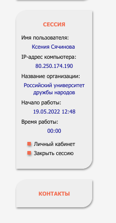{ #fig:001 width=25%}

##

   - Google Scholar : https://scholar.google.com/; (рис. [-@fig:002])

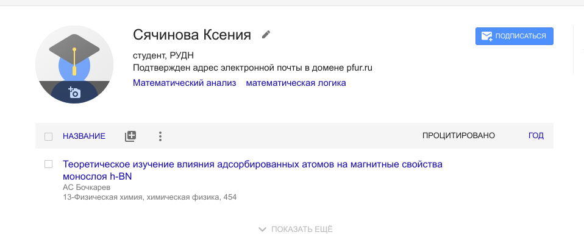{ #fig:002 width=50%}

##

   - ORCID : https://orcid.org/;(рис. [-@fig:003])
   
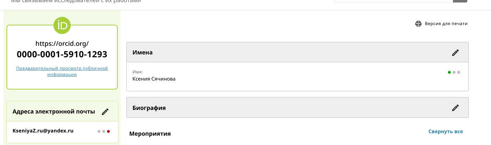{ #fig:003 width=50%}

##

   - Mendeley : https://www.mendeley.com/;(рис. [-@fig:004])
   
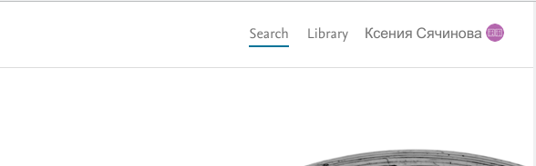{ #fig:004 width=50%}

##

   - ResearchGate : https://www.researchgate.net/;(рис. [-@fig:005])
   
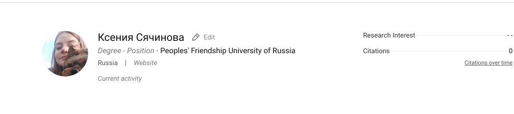{ #fig:005 width=50%}

##

   - Academia.edu : https://www.academia.edu/;(рис. [-@fig:006])
   
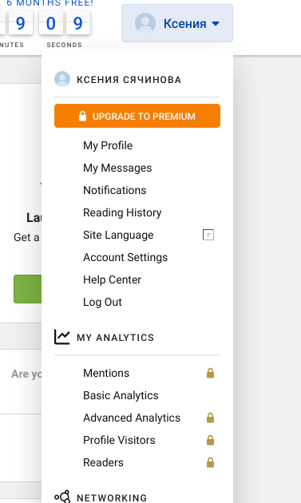{ #fig:006 width=30%}

##

   - arXiv : https://arxiv.org/;
   
   - github : https://github.com/.(рис. [-@fig:008])
   
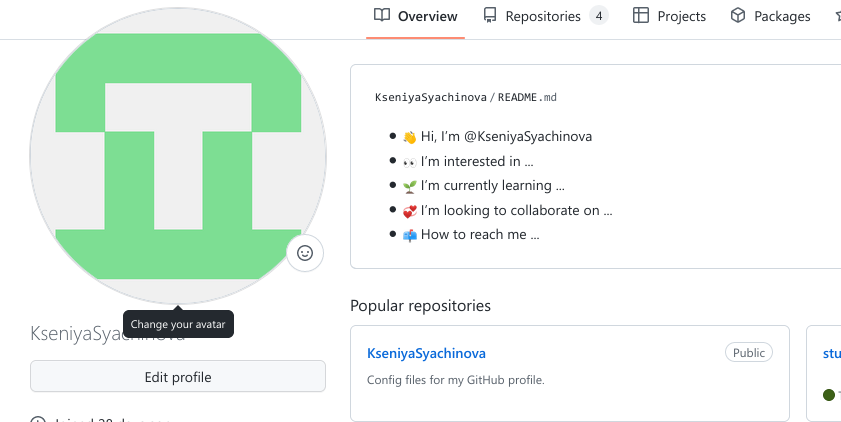{ #fig:008 width=50%}

##

Затем размещаем наши сслыки на сайте, для этого content/admin и меняем ссылки и иконки. (рис. [-@fig:009]), (рис. [-@fig:010])

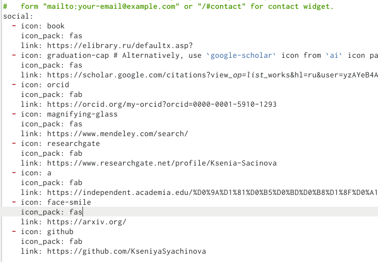{ #fig:009 width=50%}

##

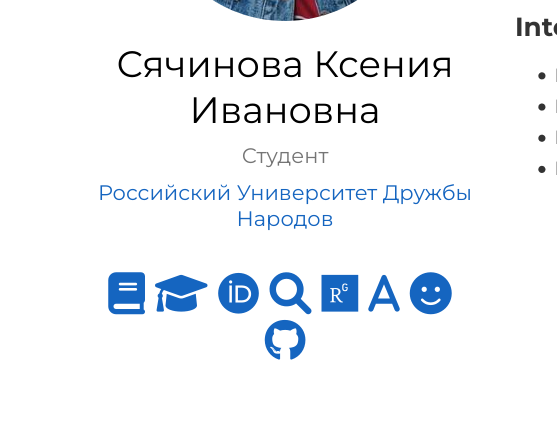{ #fig:010 width=50%}

##

2. После этого сделаем пост по прошедшей недели и пост на тему по выбору аналогично, как делали в предыдущих этапах.(рис. [-@fig:011]),(рис. [-@fig:012])

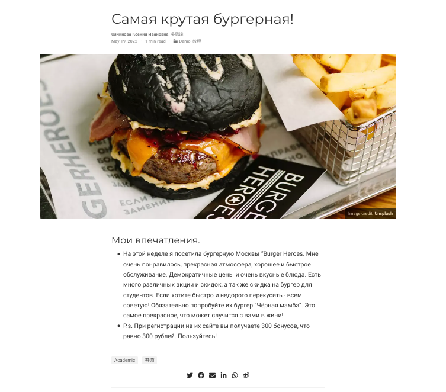{ #fig:011 width=50%}

##

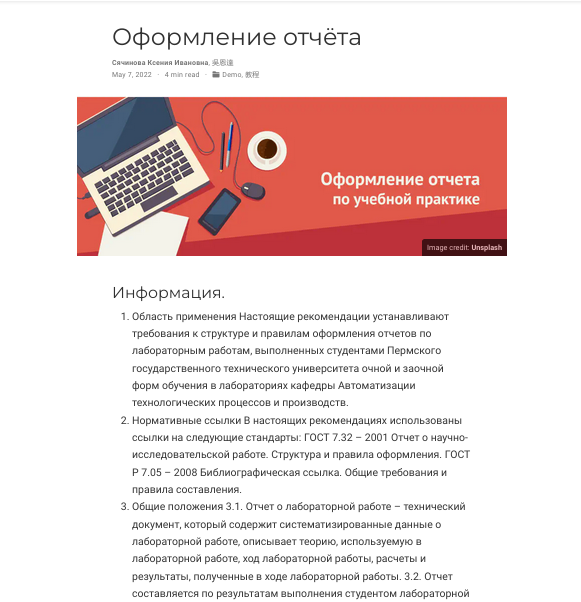{ #fig:012 width=50%}

## Выводы

Я научилась прикреплять ссылки и улучшила навык создания постов.
