---
## Front matter
title: "Отчёт по 6 этапу индивидуального проекта"
subtitle: "Операционные системы"
author: "Сячинова Ксения Ивановна"

## Generic otions
lang: ru-RU
toc-title: "Содержание"

## Bibliography
bibliography: bib/cite.bib
csl: pandoc/csl/gost-r-7-0-5-2008-numeric.csl

## Pdf output format
toc: true # Table of contents
toc-depth: 2
lof: true # List of figures
lot: true # List of tables
fontsize: 12pt
linestretch: 1.5
papersize: a4
documentclass: scrreprt
## I18n polyglossia
polyglossia-lang:
  name: russian
  options:
	- spelling=modern
	- babelshorthands=true
polyglossia-otherlangs:
  name: english
## I18n babel
babel-lang: russian
babel-otherlangs: english
## Fonts
mainfont: PT Serif
romanfont: PT Serif
sansfont: PT Sans
monofont: PT Mono
mainfontoptions: Ligatures=TeX
romanfontoptions: Ligatures=TeX
sansfontoptions: Ligatures=TeX,Scale=MatchLowercase
monofontoptions: Scale=MatchLowercase,Scale=0.9
## Biblatex
biblatex: true
biblio-style: "gost-numeric"
biblatexoptions:
  - parentracker=true
  - backend=biber
  - hyperref=auto
  - language=auto
  - autolang=other*
  - citestyle=gost-numeric
## Pandoc-crossref LaTeX customization
figureTitle: "Рис."
tableTitle: "Таблица"
listingTitle: "Листинг"
lofTitle: "Список иллюстраций"
lotTitle: "Список таблиц"
lolTitle: "Листинги"
## Misc options
indent: true
header-includes:
  - \usepackage{indentfirst}
  - \usepackage{float} # keep figures where there are in the text
  - \floatplacement{figure}{H} # keep figures where there are in the text
---

# Цель работы

   - Сделать поддержку английского и русского языков.
   - Разместить элементы сайта на обоих языках.
   - Разместить контент на обоих языках.
   - Сделать пост по прошедшей неделе.
   - Добавить пост на тему по выбору (на двух языках).

# Выполнение лабораторной работы

1.  Будем действовать по алгоритму, который есть на сайте [https://wowchemy.com/docs/getting-started/page-builder/#icons]. Сначала создаём папку i18n и создаём там два файл ru.yaml и en.ymal. Затем, размещаем там скрипты для русского и английского языка. (рис. [-@fig:001]), (рис. [-@fig:002])

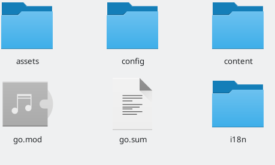{ #fig:001 width=50%}

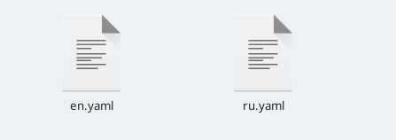{ #fig:002 width=50%}

Для удобства создаю в папке contant две папки, в которых будут храниться все файлы на разных языках. (рис. [-@fig:003])

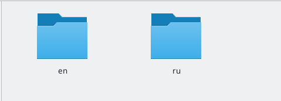{ #fig:003 width=50%}

После этого меняем во всех файлах типа md информацию на английский язык. Все посты, меню, достижения и прочее разделы переводим вручную. Вот несколько примеров. (рис. [-@fig:004]), (рис. [-@fig:005]), (рис. [-@fig:006]), (рис. [-@fig:007])

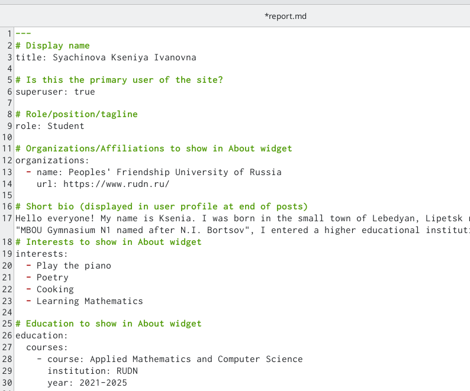{ #fig:004 width=50%}

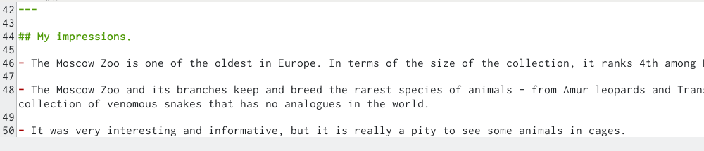{ #fig:005 width=50%}

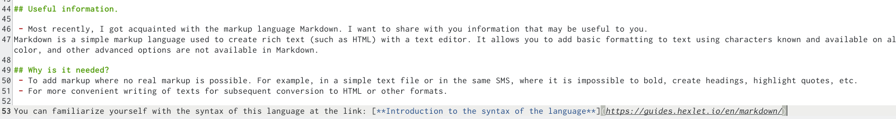{ #fig:006 width=50%}

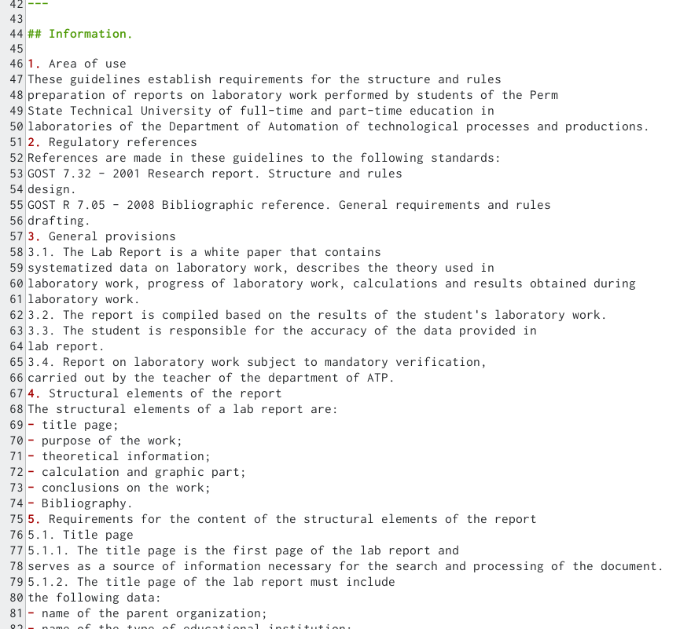{ #fig:007 width=50%}

Вот что вышло на сайте. (рис. [-@fig:008]), (рис. [-@fig:009]), (рис. [-@fig:010])

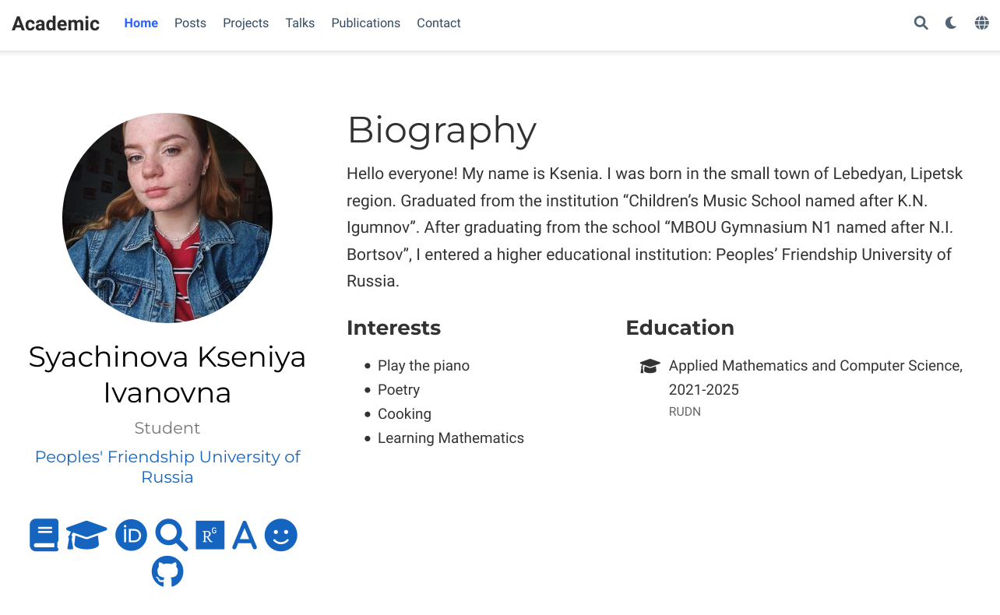{ #fig:008 width=50%}

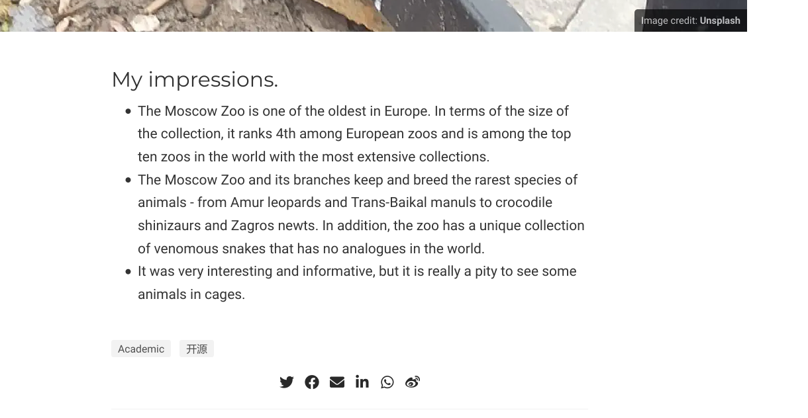{ #fig:009 width=50%}

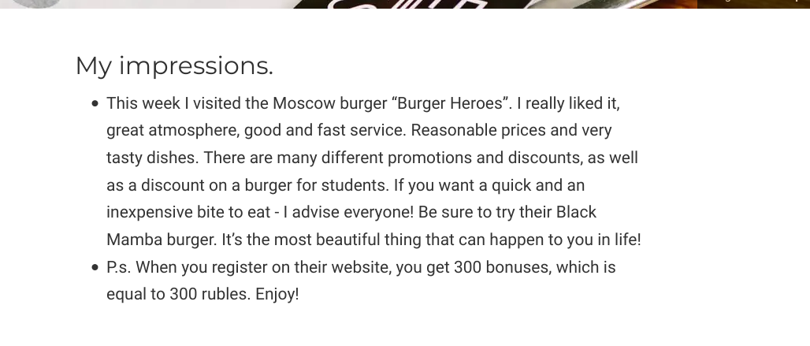{ #fig:010 width=50%}

После этого сделали пост по прошедшей неделе и также перевели его на английский язык.(рис. [-@fig:011]), (рис. [-@fig:012])

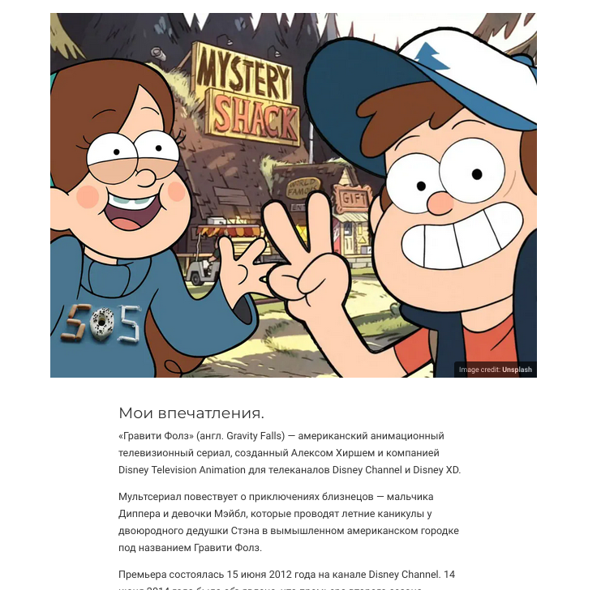{ #fig:011 width=50%}

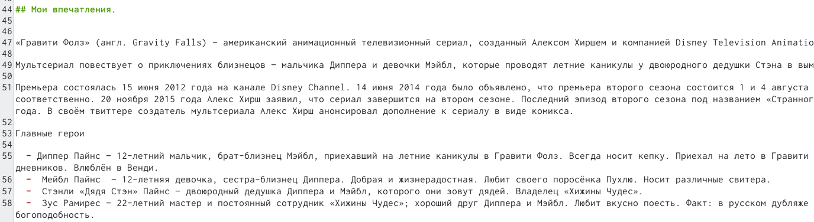{ #fig:012 width=50%}

После этого делаем пост на любую тему, рецепт блинчиков. (рис. [-@fig:013])

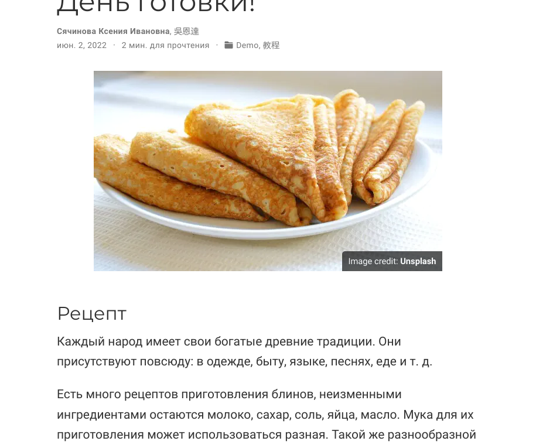{ #fig:013 width=50%}

Запускаем сайт и проверяем, всё работает корректно!

# Выводы

Мы научились делать поддержку английского и русского языков и отработали навык написания постов, и закончили делать сайт.
