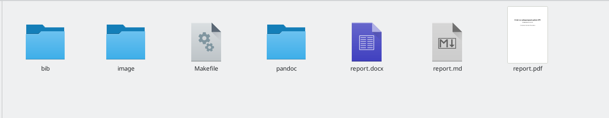
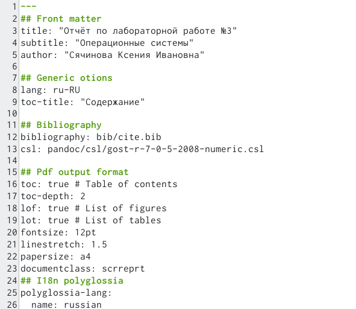
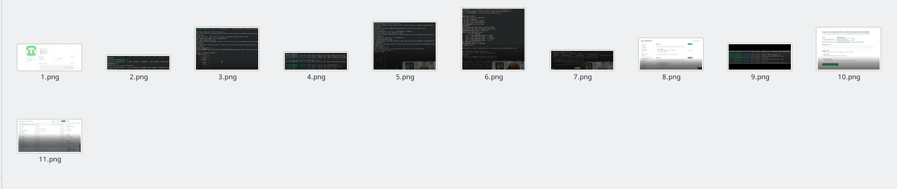
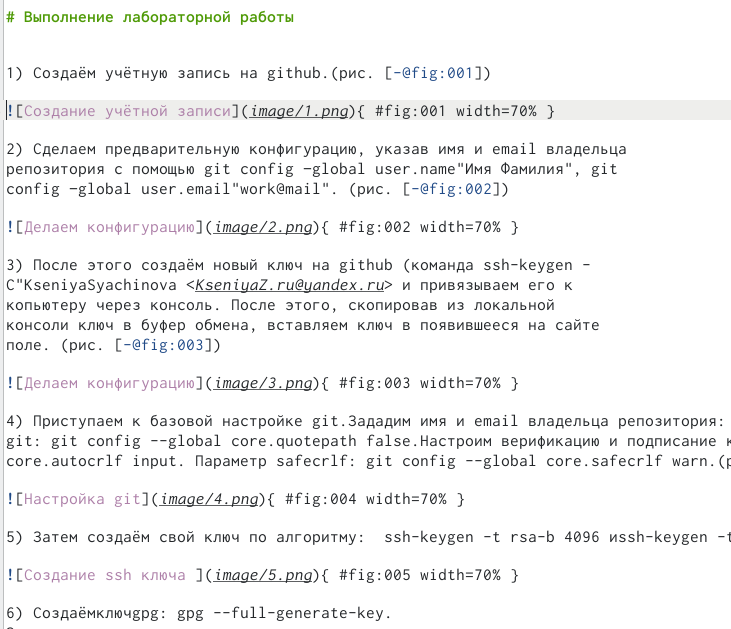
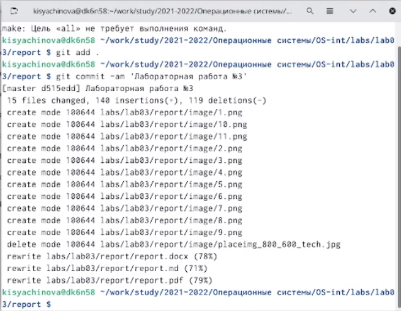

---
## Front matter
lang: ru-RU
title: Презентация по лабораторной работе №3
author: |
	Сячинова Ксения Ивановна
	НПМбд-02-21
institute: |
	Российский Университет дружбы народов
## Formatting
toc: false
slide_level: 2
theme: metropolis
header-includes: 
 - \metroset{progressbar=frametitle,sectionpage=progressbar,numbering=fraction}
 - '\makeatletter'
 - '\beamer@ignorenonframefalse'
 - '\makeatother'
aspectratio: 43
section-titles: true
---

# Цель работы 
Цель работы:научиться оформлять отчёты с помощью легковесного языка разметки Markdown, а также познакомиться с основными возможностями разметки Markdown.

# Задание
Сделайте отчёт по предыдущей лабораторной работе в формате Markdown.
В качестве отчёта просьба предоставить отчёты в 3 форматах: pdf, docx и md (в архиве,
поскольку он должен содержать скриншоты, Makefile и т.д.)

# Выполнение лабораторной работы
1) Перешли в папаку work-study-2021-2022-Операционные системы-OS-int-labs-lab03-report.(рис. [-@fig:011])

{ #fig:011 width=70% }

2) Затем открываем report.md и начинаем оформлять наш отчёт. Вводим корректные данные: ФИО, название презентации, подзаголовок и тд. (рис. [-@fig:022])

{ #fig:022 width=45% }

## Продолжение выполнения
3) Предварительно скриншоты копируем в папку images и даём им названия.(рис. [-@fig:033])

{ #fig:033 width=70% }

4) Далее оформляем нашу работу по шаблону.(рис. [-@fig:044])

{ #fig:044 width=40% }

## Последние шаги:
5) После завершения с помощью команды make делаем наши файлы. Затем загружаем на github с помощью основных комманд: git add .; git commit -am 'комментарий'; git push (рис. [-@fig:055])

{ #fig:055 width=70% }

# Вывод: 
Я научилась офомлять отчёты в Markdown, познакомилась с основными его возможностями.
