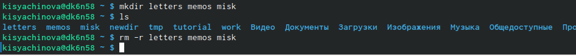

---
## Front matter
lang: ru-RU
title: Презентация по лабораторной работе №4
author: |
	Сячинова Ксения Ивановна
institute: |
	Российский Университет дружбы народов

## Formatting
toc: false
slide_level: 2
theme: metropolis
header-includes: 
 - \metroset{progressbar=frametitle,sectionpage=progressbar,numbering=fraction}
 - '\makeatletter'
 - '\beamer@ignorenonframefalse'
 - '\makeatother'
aspectratio: 43
section-titles: true
---

# Цель работы
Цель работы - приобретение практических навыков взаимодействия пользователя с системой по-средством командной строки.

# Задание
В качестве отчёта предоставить отчёты в 3 форматах:pdf,docxиmd(вархиве,поскольку он должен содержать скриншоты,Makefile и т.д).

## Выполнение лабораторной работы
1. Для определения полного имени домашнего каталога мы  используем команду "pwd". Если мы не находимся в нашемкаталоге, то используем команду "cd~", чтобы перейти в него. (рис. [-@fig:001])

{ #fig:001 width=70% }

##
2. 2.1 Переходим в каталог /tmp с помощью команды "cd/tmp". 
2.2 Выводим на экран содержимое каталога /tmp, используя разную команду "ls" c различными опциями.

{ #fig:002 width=50% }

## 

{ #fig:003 width=45% }

{ #fig:004 width=45% }

##

{ #fig:005 width=45% }

## 

2.3 Для того чтобы определить есть ли в каталоге /var/spool подкаталог с именем corn, переходим в указанный каталог с помощью "cd/var/spool" и с помощью "ls" проссматриваем содержимое. Каталог существет. (рис. [-@fig:007])

{ #fig:007 width=30% }

2.4 Далее переходим в домашний каталог и с помощью команды "ls -alF" видим, что владельцем всех каталогов и файлов, кроме родительского каталога, являюсь я, kisyachinova. (рис. [-@fig:008])

{ #fig:008 width=30% }

##  

3. 3.1-3.2 В домашнем каталоге создаём новый каталог newdir, с помощью команды "mkdir". С помощью "ls" проверяем наличие каталога.Затем, комнадой "cd newdir" заходим в каталог и поздаём подкаталог morefun. Наличие проверяем с помощью команды "ls" (рис. [-@fig:009])

{ #fig:009 width=70% }

3.3 В домашнем каталоге создаём одной командой три новых каталога с именами letters,memos,misk.Затем удаляем эти каталоги одной команды "rm -m letters memos misk". (рис. [-@fig:010])

{ #fig:010 width=70% }

##

.4-3.5 Теперь попробуем удалить каталог newdir командой "rm newdir". Получаем отказ, так как в нём есть подкаталог.Тогда удаляем каталог newdir/morefun с помощью команды "rm - r newdir/morefun". Командой "ls" првоеряем выполнение действий. (рис. [-@fig:011])

{ #fig:011 width=70% }

## 

4. Используя команду "man ls", определяем, какую опцию команды необходимо ипользвать, чтобы просмотреть содержимое не только указанного каталога, но и подкаталогов, входящих в него. (рис. [-@fig:012])  (рис. [-@fig:013])

{ #fig:012 width=70% }

{ #fig:013 width=70% }

##

5. Используя то же руководство, которое мы открыли с помощью "man ls" мы можем увидеть опций комманды, который позволяет отсортировать по времени последнего изменения выводимый список содержимого каталога с развёрнутым описанием файлов. (рис. [-@fig:014]) (рис. [-@fig:015]) (рис. [-@fig:016])

{ #fig:014 width=70% }

{ #fig:015 width=70% }

{ #fig:016 width=70% }

##

6. Используем команду man для просмотра описания следующих команд:cd,pwd,mkdir,rmdir,rm. (рис. [-@fig:017])

{ #fig:017 width=70% }

##

{ #fig:018 width=70% }

##

{ #fig:019 width=70% }

##

{ #fig:020 width=70% }

##

{ #fig:021 width=70% }

##

7. Выведем историю с помощью команды "history". Далее использую команду "514!^:s/morefun/morefun01" и "!512" выполним команды 514 и 512. В 514 будеь создан новый каталог morefun01 вместо morefun.(рис. [-@fig:022]) (рис. [-@fig:023])

{ #fig:022 width=70% }

{ #fig:023 width=30% }

# Вывод
В ходе  выполнения  данной  лабораторной  работы  я  приобрела практические навыкивзаимодействия с системой посредством командной строки.
