---
## Front matter
title: "Лабораторная работа №4"
subtitle: "Операционные системы"
author: "Сячинова Ксения Ивановна"

## Generic otions
lang: ru-RU
toc-title: "Содержание"

## Bibliography
bibliography: bib/cite.bib
csl: pandoc/csl/gost-r-7-0-5-2008-numeric.csl

## Pdf output format
toc: true # Table of contents
toc-depth: 2
lof: true # List of figures
lot: true # List of tables
fontsize: 12pt
linestretch: 1.5
papersize: a4
documentclass: scrreprt
## I18n polyglossia
polyglossia-lang:
  name: russian
  options:
	- spelling=modern
	- babelshorthands=true
polyglossia-otherlangs:
  name: english
## I18n babel
babel-lang: russian
babel-otherlangs: english
## Fonts
mainfont: PT Serif
romanfont: PT Serif
sansfont: PT Sans
monofont: PT Mono
mainfontoptions: Ligatures=TeX
romanfontoptions: Ligatures=TeX
sansfontoptions: Ligatures=TeX,Scale=MatchLowercase
monofontoptions: Scale=MatchLowercase,Scale=0.9
## Biblatex
biblatex: true
biblio-style: "gost-numeric"
biblatexoptions:
  - parentracker=true
  - backend=biber
  - hyperref=auto
  - language=auto
  - autolang=other*
  - citestyle=gost-numeric
## Pandoc-crossref LaTeX customization
figureTitle: "Рис."
tableTitle: "Таблица"
listingTitle: "Листинг"
lofTitle: "Список иллюстраций"
lotTitle: "Список таблиц"
lolTitle: "Листинги"
## Misc options
indent: true
header-includes:
  - \usepackage{indentfirst}
  - \usepackage{float} # keep figures where there are in the text
  - \floatplacement{figure}{H} # keep figures where there are in the text
---

# Цель работы
Приобретение практических навыков взаимодействия пользователя с системой по-средством командной строки.

# Задание
В качестве отчёта предоставить отчёты в 3 форматах:pdf,docxиmd(вархиве,поскольку он должен содержать скриншоты,Makefile и т.д).

# Выполнение лабораторной работы
1. Для определения полного имени домашнего каталога мы  используем команду "pwd". Если мы не находимся в нашемкаталоге, то используем команду "cd~", чтобы перейти в него. (рис. [-@fig:001])

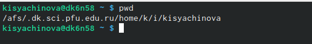{ #fig:001 width=70% }

2. 2.1 Переходим в каталог /tmp с помощью команды "cd/tmp". 
2.2 Выводим на экран содержимое каталога /tmp, используя разную команду "ls" c различными опциями.
- "ls" - выводится список каталогов и файлов, которые можно увидеть,"вручную" открыв каталог tmp. (рис. [-@fig:002])
- "ls -a" - к списку, описанному выше, добавляются скрытые каталоги и файлы (рис. [-@fig:003])
- "ls -F" - с помощью данной команды получаем информацию о типах файла. (рис. [-@fig:003])
- "ls -l" - получаем список файлов, но уже с более подробной ифнормацией о них(рис. [-@fig:004])
- "ls -alF" - данна команда отображает список всех каталогов и файлов, в том числе и скрытых, с подробной информацией о них.(рис. [-@fig:005])

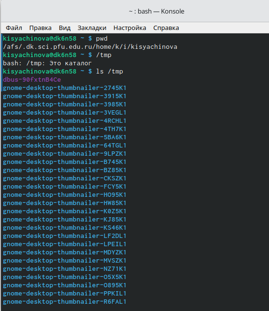{ #fig:002 width=50% }

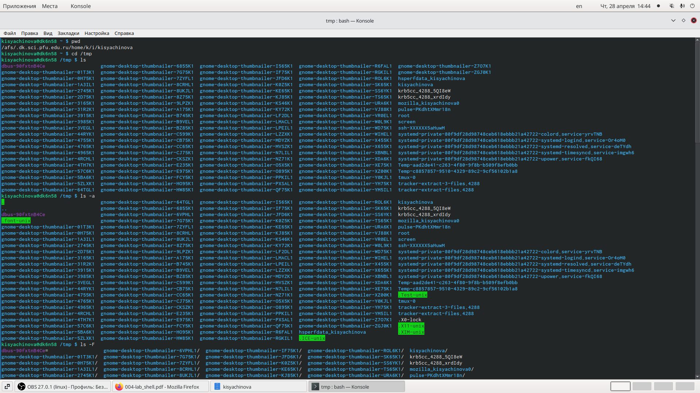{ #fig:003 width=50% }

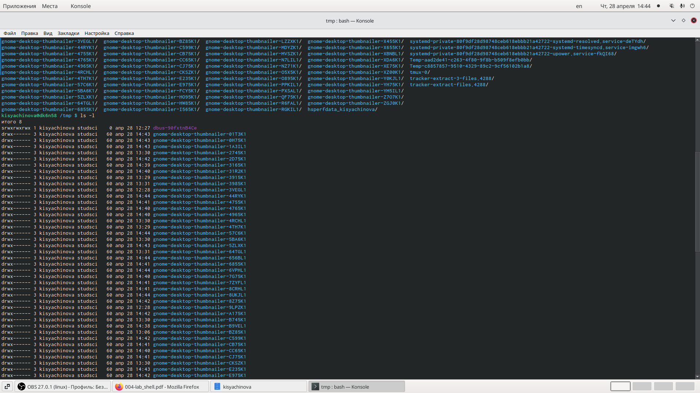{ #fig:004 width=50% }

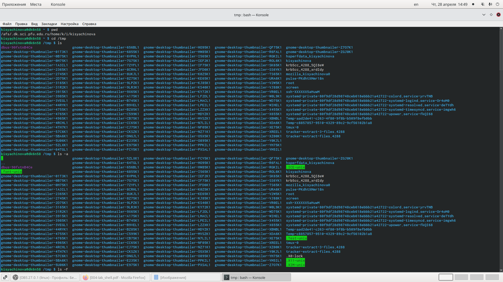{ #fig:005 width=50% }

2.3 Для того чтобы определить есть ли в каталоге /var/spool подкаталог с именем corn, переходим в указанный каталог с помощью "cd/var/spool" и с помощью "ls" проссматриваем содержимое. Каталог существет. (рис. [-@fig:007])

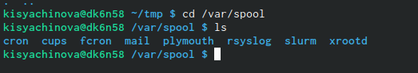{ #fig:007 width=70% }

2.4 Далее переходим в домашний каталог и с помощью команды "ls -alF" видим, что владельцем всех каталогов и файлов, кроме родительского каталога, являюсь я, kisyachinova. (рис. [-@fig:008])

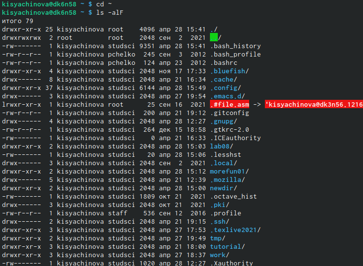{ #fig:008 width=50% }

3. 3.1-3.2 В домашнем каталоге создаём новый каталог newdir, с помощью команды "mkdir". С помощью "ls" проверяем наличие каталога.Затем, комнадой "cd newdir" заходим в каталог и поздаём подкаталог morefun. Наличие проверяем с помощью команды "ls" (рис. [-@fig:009])

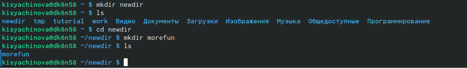{ #fig:009 width=70% }

3.3 В домашнем каталоге создаём одной командой три новых каталога с именами letters,memos,misk.Затем удаляем эти каталоги одной команды "rm -m letters memos misk". (рис. [-@fig:010])

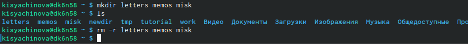{ #fig:010 width=70% }

3.4-3.5 Теперь попробуем удалить каталог newdir командой "rm newdir". Получаем отказ, так как в нём есть подкаталог.Тогда удаляем каталог newdir/morefun с помощью команды "rm - r newdir/morefun". Командой "ls" првоеряем выполнение действий. (рис. [-@fig:011])

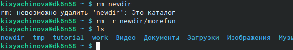{ #fig:011 width=70% }

4. Используя команду "man ls", определяем, какую опцию команды необходимо ипользвать, чтобы просмотреть содержимое не только указанного каталога, но и подкаталогов, входящих в него. (рис. [-@fig:012])  (рис. [-@fig:013])

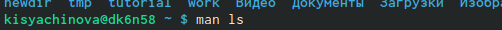{ #fig:012 width=70% }

{ #fig:013 width=70% }

5. Используя то же руководство, которое мы открыли с помощью "man ls" мы можем увидеть опций комманды, который позволяет отсортировать по времени последнего изменения выводимый список содержимого каталога с развёрнутым описанием файлов. (рис. [-@fig:014]) (рис. [-@fig:015]) (рис. [-@fig:016])

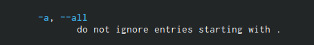{ #fig:014 width=70% }

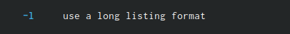{ #fig:015 width=70% }

{ #fig:016 width=70% }

6. Используем команду man для просмотра описания следующих команд:cd,pwd,mkdir,rmdir,rm. (рис. [-@fig:017])

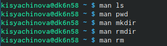{ #fig:017 width=70% }

**Команда pwd:**
- -L, --logicalне разыменовывать символические ссылки. Если путь содержит символические  ссылки,  то  выводить  их  безпреобразования  в исходный путь;
- -P, --physicalпреобразовывать(отбрасывать    символические    ссылки)символические ссылки в исходные имена. Если путь содержит символические ссылки, то они будут преобразованы в названия исходных директорий, на которые они указывают;
- --helpпоказать справку по команде pwd;
- --versionпоказать версию утилиты pwd.(рис. [-@fig:018])

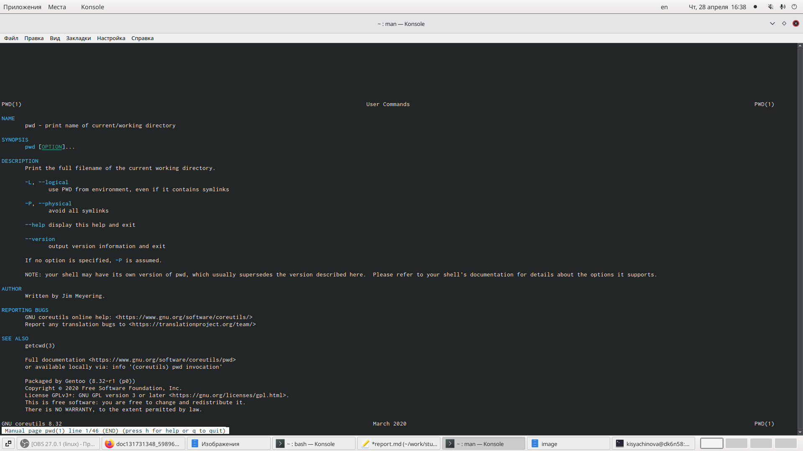{ #fig:018 width=50% }

**Команда mkdir:**
- -m,--mode=MODEустанавливает  права  доступа  для  создаваемой  директории. Синтаксис MODE такой же как у команды chmod;
- -p,--parentsсоздать  все  директории,  которые  указаны  внутри  пути.  Если какая-либо директория существует, то предупреждение об этом не выводится;
- -v, --verboseвыводить сообщение о каждой создаваемой директории; 
- -zустановить  контекст  SELinux  для  создаваемой  директории  по умолчанию;
- --context[=CTX]установить  контекст  SELinux  для  создаваемой  директории  в значение CTX;
- --helpпоказать справку по команде mkdir;
- --versionпоказать версию утилиты mkdir(рис. [-@fig:019])

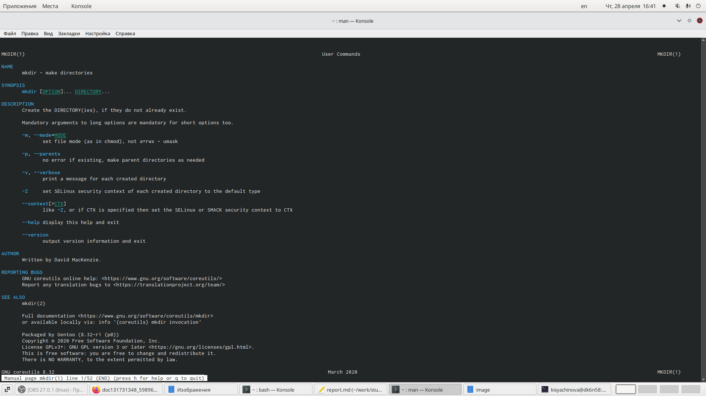{ #fig:019 width=50% }

**Команда rmdir:**
- --ignore-fail-on-non-emptyигнорировать директории, которые содержат в себе файлы;
- -p, --parentsв  этой  опции  каждый  аргумент  каталога  обрабатывается  как путь, из которого будут удалены все компоненты, если они уже пусты, начиная с последнего компонента;
- -v, --verboseотображение    подробной    информациидля    каждого обрабатываемого каталога;
- --helpпоказать справку по команде rmdir;
- --versionпоказать версию утилиты rmdir(рис. [-@fig:020])

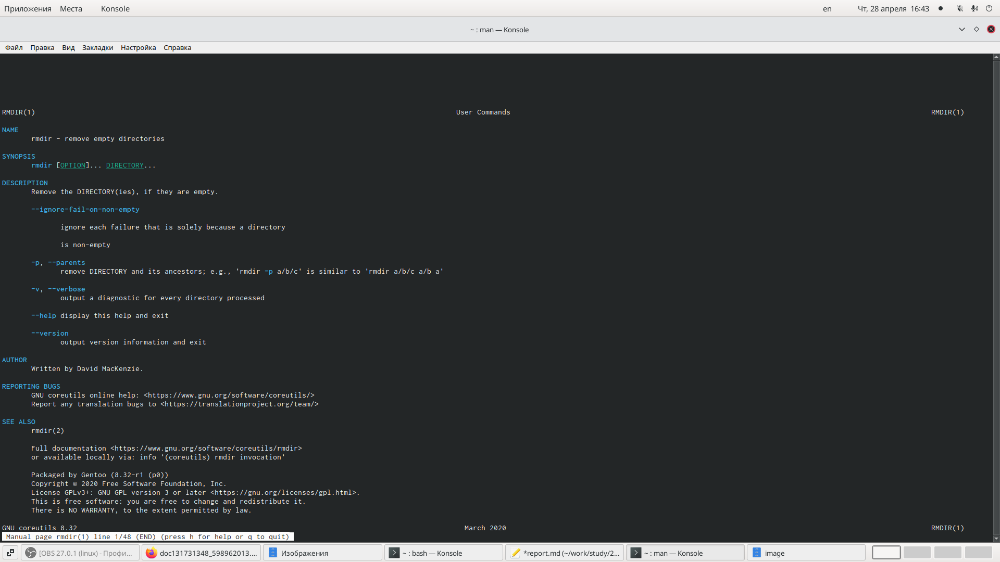{ #fig:020 width=50% }

**Команда rm:**
- -f, --forceигнорировать несуществующие файлы и аргументы. Никогда не выдавать запросы на подтверждение удаления;
- -iвыводить запрос на подтверждение удаления каждого файла;
- -Iвыдать  один  запрос  на  подтверждение  удаления  всех  файлов, если  удаляется  больше  трех  файлов  или  используется рекурсивное   удаление.   Опция   применяется,   как   более «щадящая» версия опции –i;
- --interactive[=WHEN]вместо WHENможно использовать:never —никогда  не  выдавать  запросы  на  подтверждение удаления.once —выводить запрос один раз (аналог опции -I).
always —выводить запрос всегда (аналог опции -i).Если значение КОГДА не задано, то используется always;
- --one-file-systemво  время  рекурсивного  удаления  пропускать  директории, которые находятся на других файловых системах;
- --no-preserve-rootесли в качестве директории для удаления задан корневой раздел /, то считать, что это обычная директория и начать выполнять удаление;
- --preserve-root[=all]если в качестве директории для удаления задан корневой раздел /, то запретить выполнять команду rm над корневым разделом. Данное поведение используется по умолчанию;
- -r, -R, --recursive удаление директорий и их содержимого. Рекурсивное удаление;
- -d, --dir удалять пустые директории;
- -v, --verbose выводитьинформацию об удаляемых файлах;
- --helpпоказать справку по команде `rm`;
- --versionпоказать версию утилиты rm (рис. [-@fig:021])

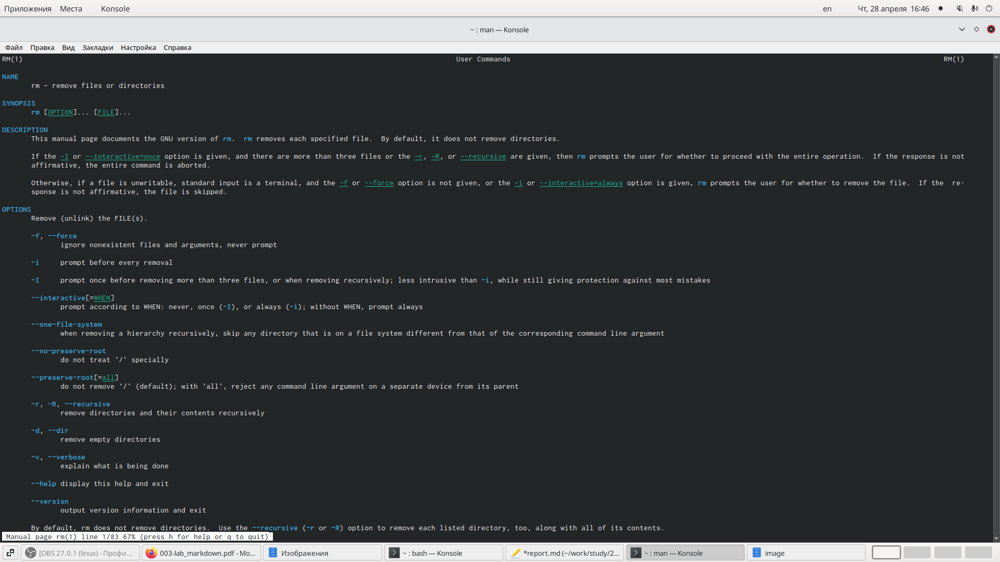{ #fig:021 width=50% }

7. Выведем историю с помощью команды "history". Далее использую команду "514!^:s/morefun/morefun01" и "!512" выполним команды 514 и 512. В 514 будеь создан новый каталог morefun01 вместо morefun.(рис. [-@fig:022]) (рис. [-@fig:023])

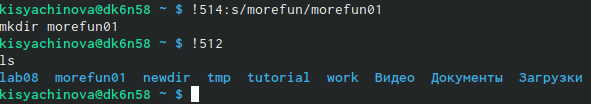{ #fig:022 width=70% }

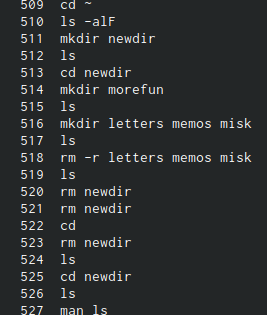{ #fig:023 width=70% }

# Ответы на контрольные вопросы.
- 1)Команднаястрока–специальная  программа, позволяющая  управлять операционной  системой  при  помощи  текстовых  команд,  вводимых  в окне приложения.
- 2)Для определения абсолютного пути к текущему каталогу используется команда  pwd  (print  working  directory). 
- 3)Команда  «ls-F» (или  «ls-aF»,  тогда  появятся  еще  скрытые  файлы) выведет имена файлов в текущем каталоге и их типы. Тип каталога обозначается /, тип исполняемого файла обозначается *, тип ссылки обозначается @.
- 4)Имена  скрытых  файлов  начинаются  с  точки.  Эти  файлы  в операционной системе скрыты от просмотра и обычно используются для  настройки  рабочей  среды.  Для  того,  чтобы  отобразить  имена скрытых файлов, необходимо использовать команду «ls –a». 
- 5)Команда  rm  используется  для  удаления  файлов  и/или  каталогов. Команда rm-iвыдает  запрос  подтверждения  наудаление  файла. Команда rm-rнеобходима, чтобы удалить каталог, содержащий файлы. Без указания этой опции команда не будет выполняться. Если каталог пуст,  то  можно  воспользоваться  командой  rmdir.  Если  удаляемый каталог  содержит  файлы,  то  команда  не  будетвыполнена –нужно использовать «rm -r имя_каталога».Таким  образом,  каталог,  не  содержащий  файлов,  можно  удалить  и командой rm, и командой rmdir. Файл командой rmdirудалить нельзя.
- 6)Чтобы  определить,  какие  команды  выполнил  пользователь  в  сеансе работы, необходимо воспользоваться командой «history».
- 7)Чтобы  исправить  илизапустить  на  выполнение  команду,  которую пользователь уже использовал в сеансе работы, необходимо: в первом случае:воспользоваться конструкцией !<номер_команды>:s/<что_меняем>/<на_что_меняем>,   во   втором случае: !<номер_команды>. 
- 8)Чтобы записать в одной строке несколько команд, необходимо между ними поставить ; . Например, «cd /tmp; ls».
- 9)Символ  обратного  слэша `\` позволяет  использовать  управляющие символы  (".",  "/",  "$",  "*",  "[",  "]",  "^",  "&")  без  их  интерпретации командной оболочкой; процедура  добавления данного  символа  перед управляющими  символами  называетсяэкранированием  символов.Например,  команда  «lsnewdir\/morefun»  отобразит  содержимое каталога newdir/morefun.
- 10)Команда «ls -l» отображает список каталогов и файлов с подробной информацией  о  них(тип  файла,  право  доступа, число  ссылок, владелец, размер, дата последней ревизии, имя файла или каталога).
- 11)Полный, абсолютный путь от корня файловой системы –этот путь начинается от корня "/" и описывает весь путь к файлуили каталогу; Относительный  путь–это  путь  к файлу  относительно  текущего каталога(каталога,  где  находится  пользователь).Например, «cd/newdir/morefun»–абсолютный  путь,  «cdnewdir»–относительный путь.
- 12)Чтобы получить необходимую информацию о команде, необходимо воспользоваться конструкцией man[имя_команды], либо использовать опцию help, которая предусмотрена для некоторых команд.
- 13)Для автоматического дополнения вводимых команд служит клавиша Tab.

# Выводы

В ходе  выполнения  данной  лабораторной  работы  я  приобрела практические навыкивзаимодействия с системой посредством командной строки.
