---
## Front matter
lang: ru-RU
title: Презентация по лабораторной работе №5
author: |
	Сячинова Ксения Ивановна НПМбд-02-21
institute: |
	Российский Университет дружбы народов

## Formatting
toc: false
slide_level: 2
theme: metropolis
header-includes: 
 - \metroset{progressbar=frametitle,sectionpage=progressbar,numbering=fraction}
 - '\makeatletter'
 - '\beamer@ignorenonframefalse'
 - '\makeatother'
aspectratio: 43
section-titles: true
---
# Цель работы

Ознакомление с файловой системой Linux, её структурой, именами и содержаниемкаталогов. Приобретение практических навыков по применению команд для работыс файлами и каталогами,по управлению процессами (и работами),по проверке исполь-зования диска и обслуживанию файловой системы.

# Выполнение лабораторной работы

1. Выполняем все примеры, приведённые в первой части описания лабораторной работы. (рис. [-@fig:001])
- Скопируем  файл  ~/abc1  в  файл  april и  в  файл may.  Для  этого создадим  файл abc1,  используя  команду  «touchabc1»,  далее осуществим копирование с помощью команд «cpabc1 april» и «cpabc1 may».
- Скопируем файлы april и may в каталогmonthly, используя команды «mkdirmonthly»  −  для  создания  каталога monthlyи  «cpaprilmaymonthly» − для копирования.
- Скопируем  файл  monthly/may  в  файл  с  именем  june.  Выполнимкоманды«cpmonthly/maymonthly/june»и«lsmonthly» (для просмотра содержимого каталога).
- Скопируемкаталог monthly в каталог monthly.00. Для этого создадим каталог monthly.00 командой  «mkdirmonthly.00»и  осуществим копирование, используя команду «cp-rmonthlymonthly.00»(команда cp  с  опцией  r  (recursive)  позволяет  копировать  каталоги  вместе  с входящими в них файлами и каталогами).
- Скопируем каталог monthly.00 в каталог /tmp, используя команду «cp -r monthly.00 /tmp».

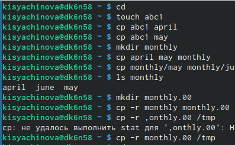{ #fig:001 width=50% }

## 
- Изменим  название  файла  april на  july  в  домашнем  каталоге, используя команду «mv april july».
- Переместим  файл  july  в  каталог  monthly.00  с  помощью  команды «mvjulymonthly.00». Проверим результат командой «lsmonthly.00».
- Переименуем  каталог monthly.00  в  monthly.01,  используя  команду «mv monthly.00 monthly.01».
- Переместимкаталог  monthly.01в  каталог  reports.  Для  этого создадим  каталог reportsс  помощью  команды  «mkdir  reports»  и выполним перемещение командой «mv monthly.01 reports».
- Переименуемкаталогreports/monthly.01 вreports/monthly командой «mv reports/monthly.01 reports/monthly»(рис. [-@fig:002])

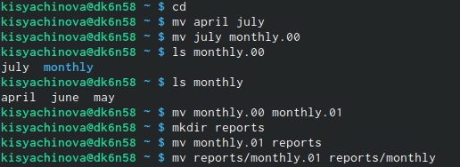{ #fig:002 width=45% }

## 

- создадимфайл  ~/may  с  правом  выполнения  для  владельца.  Для этого выполним следующие команды:«touchmay» (создание файла), «ls-lmay» (просмотр сведений о файле), «chmodu+xmay» (изменение прав), «ls-lmay».
- лишаем владельца файла  ~/may  права  на  выполнение,  используя команды:  «chmod  u-x  may»  (изменение  прав),  «ls -l  may»  (просмотр сведений о файле)
- Создаем каталог monthly с запретом на чтение для членов группы и всех остальных пользователей. Выполняем команды: «mkdir  monthly»(создание каталога), «chmodgo-rmonthly»(изменение прав).
- Создаемфайл ~/abc1 с правом записи для членов группы, используя команды:  «touchabc1»  (создание  файла),  «chmodg+wabc1» (изменение прав).(рис. [-@fig:003])

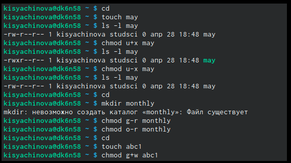{ #fig:003 width=70% }

##

2. 
- Копируем	файл	/usr/include/aio.hв домашний каталог (команда «cp /usr/include/io.h ~») и назоваем его equipment (команда «mv io.h equipment»).
- В домашнем каталоге создаем директорию ~/ski.plases (команда «mkdir ski.plases»).
- Перемещаем файл equipment в каталог ~/ski.plases (команда «mv equipment ski.plases»).
- Переименовываем файл ~/ski.plases/equipment в ~/ski.plases/equiplist (команда «mv ski.plases/equipment ski.plases/equiplist»).
- Создаем в домашнем каталоге файл abc1 (команда «touch abc1») и копируем его в каталог ~/ski.plases (команда «cp abc1 ski.plases»), называем его equiplist2 (команда «mv ski.plases/abc1 ski.plases/equiplist2»).
- Создаем каталог с именем equipment в каталоге ~/ski.plases (команда «mkdir ski.plases/equipment»).
- Перемещаем файлы ~/ski.plases/equiplist и equiplist2 в каталог ~/ski.plases/equipment (команда «mv ski.plases/equiolist ski.plases/equiplist2 ski.plases/equipment»).
- Создаем (команда «mkdir newdir») и перемещаем каталог ~/newdir в каталог ~/ski.plases (команда «mv newdir ski.plases») и называем его plans (команда «mv ski.plases/newdir ski.plases/plans»).(рис. [-@fig:004])

##

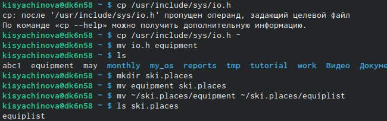{ #fig:004 width=70% }

##

3. Определяем опции команды chmod, необходимые для того, чтобы присвоить соответствующим файлам выделенные права доступа, считая, что в начале таких прав нет. Предварительно создаем необходимые файлы, используя команды: «mkdir australia», «mkdir play», «touch my_os», «touch feathers» (рис. [-@fig:005])

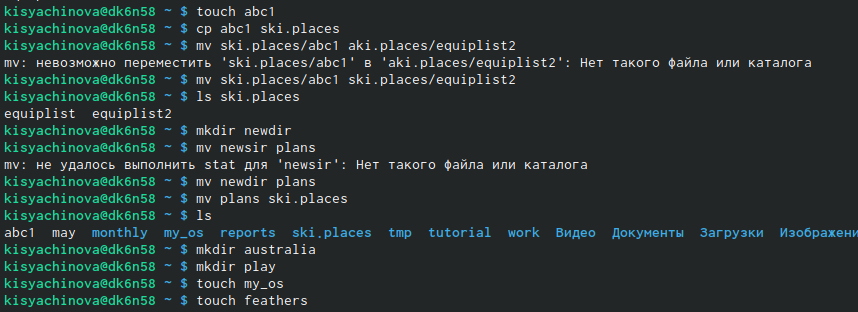{ #fig:005 width=70% }

##

Затем используем команды `drwxr--r-- ... australia: команда «chmod 744 australia», drwx--x--x ... play: команда «chmod 711 play», -r-xr--r-- ... my_os: команды «chmod 544 my_os»,  -rw-rw-r-- ... feathers: команды «chmod 664 feathers»`. Командой ls проверяем правильность действий.(рис. [-@fig:006])

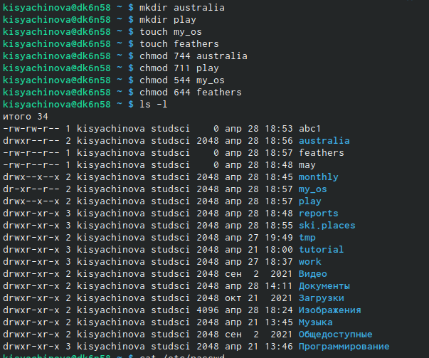{ #fig:006 width=70% }

##

4. После этого: 
- Просмотрим	содержимое	файла	/etc/passwd	(команда	«cat /etc/passwd»).
- Копируем файл ~/feathers в файл ~/file.old (команда «cp feathers file.old»).
- Переместим файл ~/file.old в каталог ~/play (команда «mv file.ord play»).
- Скопируем каталог ~/play в каталог ~/fun (команда «cp -r play fun»).
- Переместим каталог ~/fun в каталог ~/play (команда «mv fun play») и назовем его games (команда «mv play/fun play/games»).
- Лишим владельца файла ~/feathers права на чтение (команда «chmod u-r feathers»).
- Если мы попытаемся просмотреть файл ~/feathers командой cat, то получим отказ в доступе, т.к. в предыдущем пункте лишили владельца права на чтение данного файла.
- Если мы попытаемся скопировать файл ~/feathers, например, в каталог monthly, то получим отказ в доступе, по причине, описанной в предыдущем пункте.
- Дадим владельцу файла ~/feathers право на чтение (команда «chmod u+r feathers»).
- Лишим владельца каталога ~/play права на выполнение (команда «chmod u-x play»).
- Перейдем в каталог ~/play (команда «cd play»). Получим отказ в доступе, т.к. в предыдущем пункте лишили владельца права на выполнение данного каталога.
- Дадим владельцу каталога ~/play право на выполнение (команда «chmod u+x play»).(рис. [-@fig:007]) (рис. [-@fig:008])

## 

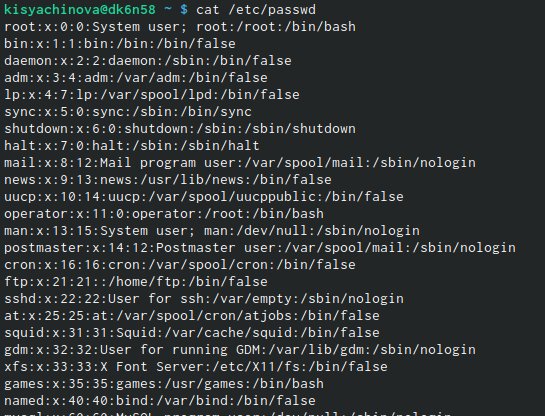{ #fig:007 width=30% }

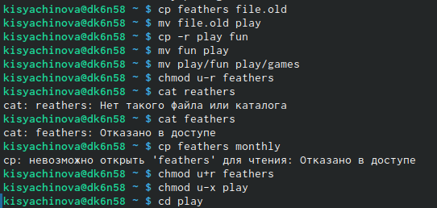{ #fig:008 width=30% }

##

Используя команды «man mount», «man fsck», «man mkfs», «man kill», получим информацию о соответствующих командах
- **Команда mount:** предназначена для монтирования файловой системы. Все файлы, доступные в Unix системах, составляют иерархическую файловую структуру, которая имеет ветки (каталоги) и листья (файлы в каталогах). Корень этого дерева обозначается как /. Физически файлы могут располагаться на различных устройствах. Команда mount служит для подключения файловых систем разных устройств к этому большому дереву.(рис. [-@fig:009])

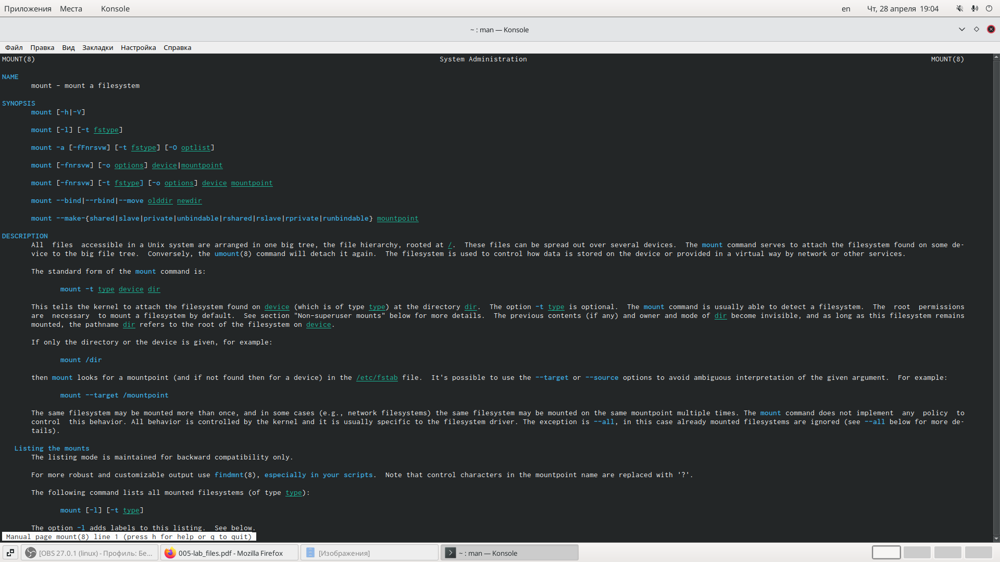{ #fig:009 width=70% }

##

- **Команда fsck:** это утилита командной строки, которая позволяет выполнять проверки согласованности и интерактивное исправление в одной или нескольких файловых системах Linux. Он использует программы, специфичные для типа файловой системы, которую он проверяет. У команды fsck следующий синтаксис: fsck [параметр] -- [параметры ФС] [<файловая система> . . .] Например, если нужно восстановить («починить») файловую систему на некотором устройстве /dev/sdb2, следует воспользоваться командой: «sudo fsck -y /dev/sdb2»(рис. [-@fig:010])

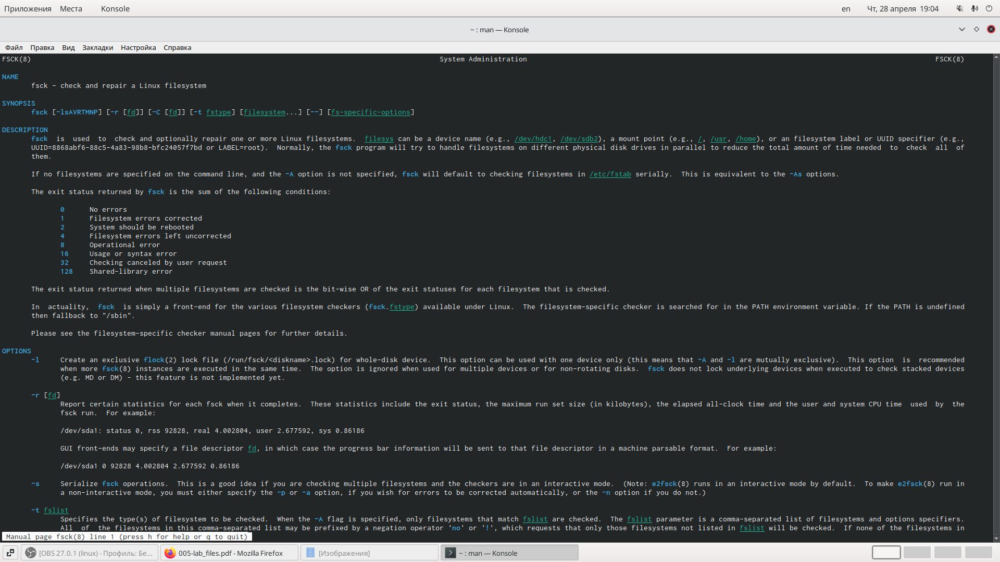{ #fig:010 width=70% }

##

- **Команда mkfs:** создаёт новую файловую систему Linux. Имеет следующий синтаксис: mkfs [ -V ] [ -t fstype ] [ fs-options ] filesys [ blocks ] mkfs используется для создания файловой системы Linux на некотором устройстве, обычно в разделе жёсткого диска. В качестве аргумента filesys для файловой системы может выступать или название устройства (например, /dev/hda1, /dev/sdb2) или точка монтирования (например, /, /usr, /home).(рис. [-@fig:011])

##

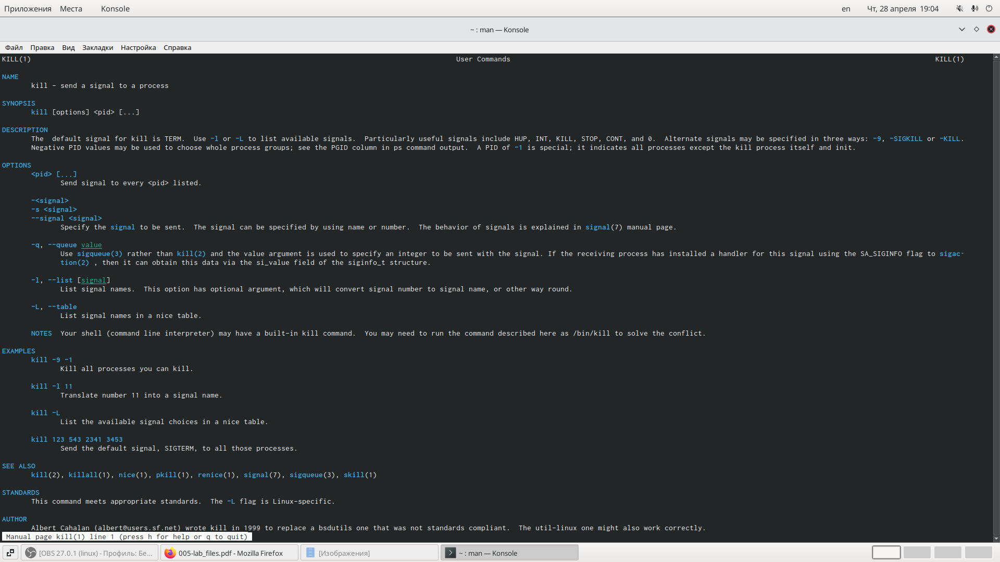{ #fig:011 width=70% }

- **Команда kill:** посылает сигнал процессу или выводит список допустимых сигналов. Имеет следующий синтаксис: kill [опции] PID, где PID – это PID (числовой идентификатор) процесса или несколько PID процессов, если требуется послать сигнал сразу нескольким процессам. Например, команда «kill -KILL 3121» посылает сигнал KILL процессу с PID 3121, чтобы принудительно завершить процесс.(рис. [-@fig:012])

2{ #fig:012 width=70% }

#Вывод 
В ходе выполнения данной лабораторной работы я ознакомилась с файловой системой Linux, её структурой, именами и содержанием каталогов, получила навыки по применению команд для работы с файлами и каталогами, по управлению процессами (и работами), по проверке использования диска и обслуживанию файловой системы.

