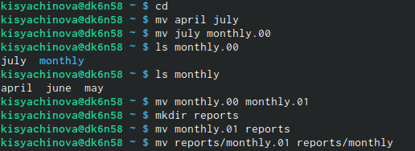
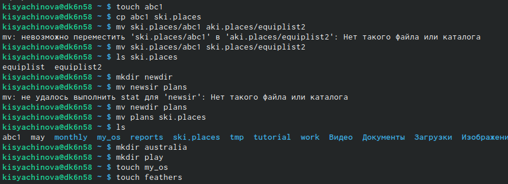
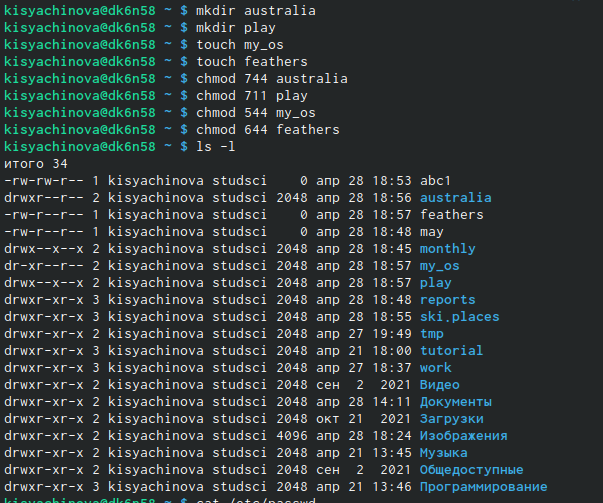
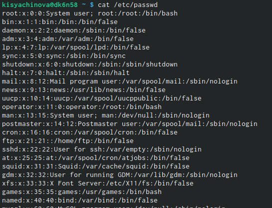
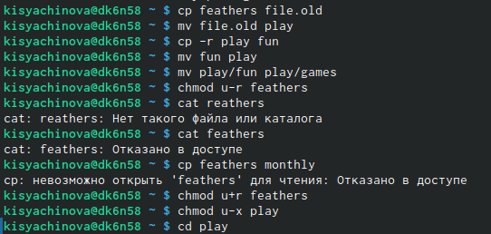
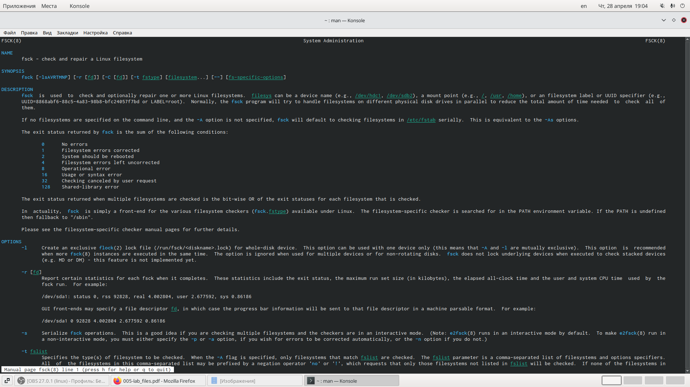
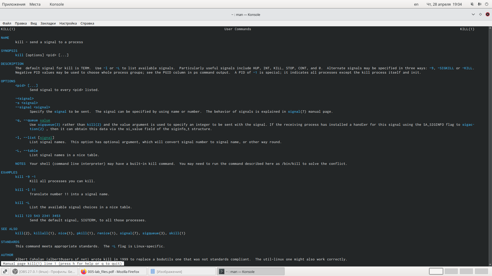

---
## Front matter
title: "Лабораторная работа №5"
subtitle: "Операционные системы"
author: "Сячинова Ксения Ивановна"

## Generic otions
lang: ru-RU
toc-title: "Содержание"

## Bibliography
bibliography: bib/cite.bib
csl: pandoc/csl/gost-r-7-0-5-2008-numeric.csl

## Pdf output format
toc: true # Table of contents
toc-depth: 2
lof: true # List of figures
lot: true # List of tables
fontsize: 12pt
linestretch: 1.5
papersize: a4
documentclass: scrreprt
## I18n polyglossia
polyglossia-lang:
  name: russian
  options:
	- spelling=modern
	- babelshorthands=true
polyglossia-otherlangs:
  name: english
## I18n babel
babel-lang: russian
babel-otherlangs: english
## Fonts
mainfont: PT Serif
romanfont: PT Serif
sansfont: PT Sans
monofont: PT Mono
mainfontoptions: Ligatures=TeX
romanfontoptions: Ligatures=TeX
sansfontoptions: Ligatures=TeX,Scale=MatchLowercase
monofontoptions: Scale=MatchLowercase,Scale=0.9
## Biblatex
biblatex: true
biblio-style: "gost-numeric"
biblatexoptions:
  - parentracker=true
  - backend=biber
  - hyperref=auto
  - language=auto
  - autolang=other*
  - citestyle=gost-numeric
## Pandoc-crossref LaTeX customization
figureTitle: "Рис."
tableTitle: "Таблица"
listingTitle: "Листинг"
lofTitle: "Список иллюстраций"
lotTitle: "Список таблиц"
lolTitle: "Листинги"
## Misc options
indent: true
header-includes:
  - \usepackage{indentfirst}
  - \usepackage{float} # keep figures where there are in the text
  - \floatplacement{figure}{H} # keep figures where there are in the text
---

# Цель работы

Ознакомление с файловой системой Linux, её структурой, именами и содержаниемкаталогов. Приобретение практических навыков по применению команд для работыс файлами и каталогами,по управлению процессами (и работами),по проверке исполь-зования диска и обслуживанию файловой системы.

# Выполнение лабораторной работы

1. Выполняем все примеры, приведённые в первой части описания лабораторной работы. (рис. [-@fig:001])
- Скопируем  файл  ~/abc1  в  файл  april и  в  файл may.  Для  этого создадим  файл abc1,  используя  команду  «touchabc1»,  далее осуществим копирование с помощью команд «cpabc1 april» и «cpabc1 may».
- Скопируем файлы april и may в каталогmonthly, используя команды «mkdirmonthly»  −  для  создания  каталога monthlyи  «cpaprilmaymonthly» − для копирования.
- Скопируем  файл  monthly/may  в  файл  с  именем  june.  Выполнимкоманды«cpmonthly/maymonthly/june»и«lsmonthly» (для просмотра содержимого каталога).
- Скопируемкаталог monthly в каталог monthly.00. Для этого создадим каталог monthly.00 командой  «mkdirmonthly.00»и  осуществим копирование, используя команду «cp-rmonthlymonthly.00»(команда cp  с  опцией  r  (recursive)  позволяет  копировать  каталоги  вместе  с входящими в них файлами и каталогами).
- Скопируем каталог monthly.00 в каталог /tmp, используя команду «cp -r monthly.00 /tmp».

{ #fig:001 width=70% }

- Изменим  название  файла  april на  july  в  домашнем  каталоге, используя команду «mv april july».
- Переместим  файл  july  в  каталог  monthly.00  с  помощью  команды «mvjulymonthly.00». Проверим результат командой «lsmonthly.00».
- Переименуем  каталог monthly.00  в  monthly.01,  используя  команду «mv monthly.00 monthly.01».
- Переместимкаталог  monthly.01в  каталог  reports.  Для  этого создадим  каталог reportsс  помощью  команды  «mkdir  reports»  и выполним перемещение командой «mv monthly.01 reports».
- Переименуемкаталогreports/monthly.01 вreports/monthly командой «mv reports/monthly.01 reports/monthly»(рис. [-@fig:002])

{ #fig:002 width=70% }

- создадимфайл  ~/may  с  правом  выполнения  для  владельца.  Для этого выполним следующие команды:«touchmay» (создание файла), «ls-lmay» (просмотр сведений о файле), «chmodu+xmay» (изменение прав), «ls-lmay».
- лишаем владельца файла  ~/may  права  на  выполнение,  используя команды:  «chmod  u-x  may»  (изменение  прав),  «ls -l  may»  (просмотр сведений о файле)
- Создаем каталог monthly с запретом на чтение для членов группы и всех остальных пользователей. Выполняем команды: «mkdir  monthly»(создание каталога), «chmodgo-rmonthly»(изменение прав).
- Создаемфайл ~/abc1 с правом записи для членов группы, используя команды:  «touchabc1»  (создание  файла),  «chmodg+wabc1» (изменение прав).(рис. [-@fig:003])

{ #fig:003 width=70% }

2. 
- Копируем	файл	/usr/include/aio.hв домашний каталог (команда «cp /usr/include/io.h ~») и назоваем его equipment (команда «mv io.h equipment»).
- В домашнем каталоге создаем директорию ~/ski.plases (команда «mkdir ski.plases»).
- Перемещаем файл equipment в каталог ~/ski.plases (команда «mv equipment ski.plases»).
- Переименовываем файл ~/ski.plases/equipment в ~/ski.plases/equiplist (команда «mv ski.plases/equipment ski.plases/equiplist»).
- Создаем в домашнем каталоге файл abc1 (команда «touch abc1») и копируем его в каталог ~/ski.plases (команда «cp abc1 ski.plases»), называем его equiplist2 (команда «mv ski.plases/abc1 ski.plases/equiplist2»).
- Создаем каталог с именем equipment в каталоге ~/ski.plases (команда «mkdir ski.plases/equipment»).
- Перемещаем файлы ~/ski.plases/equiplist и equiplist2 в каталог ~/ski.plases/equipment (команда «mv ski.plases/equiolist ski.plases/equiplist2 ski.plases/equipment»).
- Создаем (команда «mkdir newdir») и перемещаем каталог ~/newdir в каталог ~/ski.plases (команда «mv newdir ski.plases») и называем его plans (команда «mv ski.plases/newdir ski.plases/plans»).(рис. [-@fig:004])

{ #fig:004 width=70% }

3. Определяем опции команды chmod, необходимые для того, чтобы присвоить соответствующим файлам выделенные права доступа, считая, что в начале таких прав нет. Предварительно создаем необходимые файлы, используя команды: «mkdir australia», «mkdir play», «touch my_os», «touch feathers» (рис. [-@fig:005])

{ #fig:005 width=70% }

Затем используем команды `drwxr--r-- ... australia: команда «chmod 744 australia», drwx--x--x ... play: команда «chmod 711 play», -r-xr--r-- ... my_os: команды «chmod 544 my_os»,  -rw-rw-r-- ... feathers: команды «chmod 664 feathers»`. Командой ls проверяем правильность действий.(рис. [-@fig:006])

{ #fig:006 width=70% }

4. После этого: 
- Просмотрим	содержимое	файла	/etc/passwd	(команда	«cat /etc/passwd»).
- Копируем файл ~/feathers в файл ~/file.old (команда «cp feathers file.old»).
- Переместим файл ~/file.old в каталог ~/play (команда «mv file.ord play»).
- Скопируем каталог ~/play в каталог ~/fun (команда «cp -r play fun»).
- Переместим каталог ~/fun в каталог ~/play (команда «mv fun play») и назовем его games (команда «mv play/fun play/games»).
- Лишим владельца файла ~/feathers права на чтение (команда «chmod u-r feathers»).
- Если мы попытаемся просмотреть файл ~/feathers командой cat, то получим отказ в доступе, т.к. в предыдущем пункте лишили владельца права на чтение данного файла.
- Если мы попытаемся скопировать файл ~/feathers, например, в каталог monthly, то получим отказ в доступе, по причине, описанной в предыдущем пункте.
- Дадим владельцу файла ~/feathers право на чтение (команда «chmod u+r feathers»).
- Лишим владельца каталога ~/play права на выполнение (команда «chmod u-x play»).
- Перейдем в каталог ~/play (команда «cd play»). Получим отказ в доступе, т.к. в предыдущем пункте лишили владельца права на выполнение данного каталога.
- Дадим владельцу каталога ~/play право на выполнение (команда «chmod u+x play»).(рис. [-@fig:007]) (рис. [-@fig:008])

{ #fig:007 width=70% }

{ #fig:008 width=70% }

5. Используя команды «man mount», «man fsck», «man mkfs», «man kill», получим информацию о соответствующих командах
- **Команда mount:** предназначена для монтирования файловой системы. Все файлы, доступные в Unix системах, составляют иерархическую файловую структуру, которая имеет ветки (каталоги) и листья (файлы в каталогах). Корень этого дерева обозначается как /. Физически файлы могут располагаться на различных устройствах. Команда mount служит для подключения файловых систем разных устройств к этому большому дереву.(рис. [-@fig:009])

{ #fig:009 width=70% }

- **Команда fsck:** это утилита командной строки, которая позволяет выполнять проверки согласованности и интерактивное исправление в одной или нескольких файловых системах Linux. Он использует программы, специфичные для типа файловой системы, которую он проверяет. У команды fsck следующий синтаксис: fsck [параметр] -- [параметры ФС] [<файловая система> . . .] Например, если нужно восстановить («починить») файловую систему на некотором устройстве /dev/sdb2, следует воспользоваться командой: «sudo fsck -y /dev/sdb2»(рис. [-@fig:010])

{ #fig:010 width=70% }

- **Команда mkfs:** создаёт новую файловую систему Linux. Имеет следующий синтаксис: mkfs [ -V ] [ -t fstype ] [ fs-options ] filesys [ blocks ] mkfs используется для создания файловой системы Linux на некотором устройстве, обычно в разделе жёсткого диска. В качестве аргумента filesys для файловой системы может выступать или название устройства (например, /dev/hda1, /dev/sdb2) или точка монтирования (например, /, /usr, /home).(рис. [-@fig:011])

{ #fig:011 width=70% }

- **Команда kill:** посылает сигнал процессу или выводит список допустимых сигналов. Имеет следующий синтаксис: kill [опции] PID, где PID – это PID (числовой идентификатор) процесса или несколько PID процессов, если требуется послать сигнал сразу нескольким процессам. Например, команда «kill -KILL 3121» посылает сигнал KILL процессу с PID 3121, чтобы принудительно завершить процесс.(рис. [-@fig:012])

2{ #fig:012 width=70% }

# Ответы на контрольные вопросы
- Чтобы узнать, какие файловые системы существуют на жёстком диске моего компьютера, использую команду «df -Th» (Рисунок 15). Из рисунка видно, что на моем компьютере есть следующие файловые системы: devtmpfs, tmpfs, ext4, iso9660.
devtmpfs позволяет ядру создать экземпляр tmpfs с именем devtmpfs при инициализации ядра, прежде чем регистрируется какое-либо устройство с драйверами. Каждое устройство с майором / минором будет предоставлять узел устройства в devtmpfs. devtmpfs монтируется на /dev и содержит специальные файлы устройств для всех устройств. tmpfs − временное файловое хранилище во многих Unix-подобных ОС.	Предназначена	для	монтирования	файловой	системы,		но размещается в ОЗУ вместо ПЗУ. Подобная конструкция является RAM диском.	Данная	файловая		система	также	предназначенная	для быстрого и ненадёжного хранения временных данных.
Хорошо	подходит	для	/tmp	и	массовой	сборки	пакетов/образов. Предполагает наличие достаточного объёма виртуальной памяти.
Файловая система tmpfs предназначена для того, чтобы использовать
часть физической памяти сервера как обычный дисковый раздел, в котором можно сохранять данные (чтение и запись). Поскольку данные размещены в памяти, то чтение или запись происходят во много раз быстрее, чем с обычного HDD диска.
ext4 − имеет обратную совместимость с предыдущими версиями ФС. Эта версия была выпущена в 2008 году. Является первой ФС из
«семейства» Ext, использующая механизм «extent file system», который позволяет добиться меньшей фрагментации файлов и увеличить общую производительность файловой системы. Кроме того, в Ext4 реализован механизм отложенной записи (delayed allocation − delalloc), который так же уменьшает фрагментацию диска и снижает нагрузку на CPU. С другой стороны, хотя механизм отложенной записи и используется во многих ФС, но в силу сложности своей реализации он повышает вероятность утери данных.
Характеристики:
    • максимальный размер файла: 16 TB;
    • максимальный размер раздела: 16 TB;
    • максимальный размер имени файла: 255 символов. Рекомендации по использованию:
    • наилучший выбор для SSD;
    • наилучшая производительность по сравнению с предыдущими Etx- системами;
    • она так же отлично подходит в качестве файловой системы для серверов баз данных, хотя сама система и моложе Ext3.
ISO 9660 − стандарт, выпущенный Международной организацией по стандартизации, описывающий файловую систему для дисков CD- ROM. Также известен как CDFS (Compact Disc File System). Целью стандарта является обеспечить совместимость носителей под разными операционными системами, такими, как Unix, Mac OS, Windows.

- Файловая система Linux/UNIX физически представляет собой пространство раздела диска разбитое на блоки фиксированного размера, кратные размеру сектора − 1024, 2048, 4096 или 8120 байт. Размер блока указывается при создании файловой системы. В файловой структуре Linux имеется один корневой раздел − / (он же root, корень). Все разделы жесткого диска (если их несколько) представляют собой структуру подкаталогов, "примонтированных" к определенным каталогам
- Чтобы содержимое некоторой файловой системы было доступно операционной системе необходимо воспользоваться командой mount.
- Целостность файловой системы может быть нарушена из-за перебоев в питании, неполадок в оборудовании или из-за некорректного/внезапного выключения компьютера. Чтобы устранить повреждения файловой системы необходимо использовать команду fsck.
- Файловую систему можно создать, используя команду mkfs. Ее краткое описание дано в пункте 5) в ходе выполнения заданий лабораторной работы.
- Для просмотра текстовых файлов существуют следующие команды:
Задача команды cat очень проста − она читает данные из файла или стандартного ввода и выводит их на экран.
Синтаксис утилиты:
cat [опции] файл1 файл2 ... Основные опции:
-b – нумеровать только непустые строки
-E – показывать символ $ в конце каждой строки
-n – нумеровать все строки
-s – удалять пустые повторяющиеся строки
-T – отображать табуляции в виде ^I
-h – отобразить справку
-v – версия утилиты
Команда nl действует аналогично команде cat, но выводит еще и номера строк в столбце слева.
Cущественно более развитая команда для пролистывания текста. При чтении данных со стандартного ввода она создает буфер, который позволяет листать текст как вперед, так и назад, а также искать как по направлению к концу, так и по направлению к началу текста.
Синтаксис аналогичный синтаксису команды cat. Некоторые опции:
-g – при поиске подсвечивать только текущее найденное слово (по умолчанию подсвечиваются все вхождения)
-N – показывать номера строк
Команда head выводит начальные строки (по умолчанию − 10) из одного или нескольких документов. Также она может показывать данные, которые передает на вывод другая утилита.
Синтаксис аналогичный синтаксису команды cat. Основные опции:
-c (--bytes) − позволяет задавать количество текста не в строках, а в байтах
-n (--lines) − показывает заданное количество строк вместо 10, которые выводятся по умолчанию
-q (--quiet, --silent) − выводит только текст, не добавляя к нему название файла
-v (--verbose) − перед текстом выводит название файла
-z (--zero-terminated) − символы перехода на новую строку заменяет символами завершения строк

Эта команда позволяет выводить заданное количество строк с конца файла, а также выводить новые строки в интерактивном режиме.
Синтаксис аналогичный синтаксису команды cat. Основные опции:
-c − выводить указанное количество байт с конца файла
-f − обновлять информацию по мере появления новых строк в файле
-n − выводить указанное количество строк из конца файла
--pid − используется с опцией -f, позволяет завершить работу утилиты, когда завершится указанный процесс
-q − не выводить имена файлов
--retry − повторять попытки открыть файл, если он недоступен
-v − выводить подробную информацию о файле
- Утилита cp позволяет полностью копировать файлы и директории. Cинтаксис:
cp [опции] файл-источник файл-приемник
После выполнения команды файл-источник будет полностью перенесен в файл-приемник. Если в конце указан слэш, файл будет записан в заданную директорию с оригинальным именем.
Основные опции:
--attributes-only − не копировать содержимое файла, а только флаги доступа и владельца
-f, --force − перезаписывать существующие файлы
-i, --interactive − спрашивать, нужно ли перезаписывать существующие файлы
-L − копировать не символические ссылки, а то, на что они указывают
-n − не перезаписывать существующие файлы
-P − не следовать символическим ссылкам
-r − копировать папку Linux рекурсивно
-s	−	не	выполнять	копирование	файлов	в	Linux,	а	создавать символические ссылки
-u − скопировать файл, только если он был изменён
-x − не выходить за пределы этой файловой системы
-p − сохранять владельца, временные метки и флаги доступа при копировании
-t − считать файл-приемник директорией и копировать файл-источник в эту директорию
- Команда mv используется для перемещения одного или нескольких файлов (или директорий) в другую директорию, а также для переименования файлов и директорий.
Синтаксис:
mv [-опции] старый_файл новый_файл Основные опции:
--help − выводит на экран официальную документацию об утилите
--version − отображает версию mv
-b	−	создает	копию	файлов,	которые	были	перемещены	или перезаписаны
-f − при активации не будет спрашивать разрешение у владельца файла, если речь идет о перемещении или переименовании файла
-i − наоборот, будет спрашивать разрешение у владельца
-n − отключает перезапись уже существующих объектов
--strip-trailing-slashes — удаляет завершающий символ / у файла при его наличии
-t [директория] — перемещает все файлы в указанную директорию
-u − осуществляет перемещение только в том случае, если исходный файл новее объекта назначения
-v − отображает сведения о каждом элементе во время обработки команды
Команда rename также предназначена, чтобы переименовать файл. Синтаксис:
rename [опции] старое_имя новое_имя файлы Основные опции:
-v − вывести список обработанных файлов
-n − тестовый режим, на самом деле никакие действия выполнены не будут
-f − принудительно перезаписывать существующие файлы
- Права доступа − совокупность правил, регламентирующих порядок и условия доступа субъекта к объектам информационной системы (информации, её носителям, процессам и другим ресурсам) установленных правовыми документами или собственником, владельцем информации.
Права доступа к файлу или каталогу можно изменить, воспользовавшись командой chmod. Сделать это может владелец файла (или каталога) или пользователь с правами администратора.
Синтаксис команды:
chmod режим имя_файла
Режим имеет следующие компоненты структуры и способ записи:
= установить право
- лишить права
+ дать право r чтение
w запись
x выполнение
u (user) владелец файла
g (group) группа, к которой принадлежит владелец файла o (others) все остальные

# Вывод
В ходе выполнения данной лабораторной работы я ознакомилась с файловой системой Linux, её структурой, именами и содержанием каталогов, получила навыки по применению команд для работы с файлами и каталогами, по управлению процессами (и работами), по проверке использования диска и обслуживанию файловой системы.
