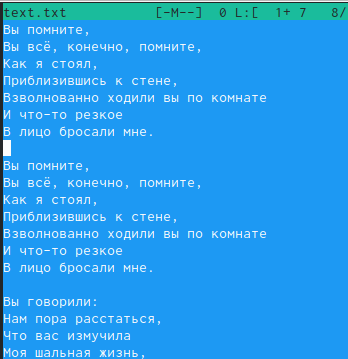
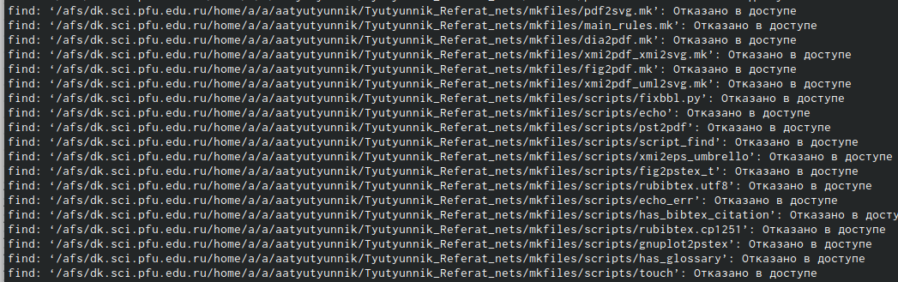

---
## Front matter
lang: ru-RU
title: Выполнение лабораторной работы №7
author: |
	Сячинова Ксения Ивановна НПМбд-02-21
institute: |
	Российский университет дружбы народов

## Formatting
toc: false
slide_level: 2
theme: metropolis
header-includes: 
 - \metroset{progressbar=frametitle,sectionpage=progressbar,numbering=fraction}
 - '\makeatletter'
 - '\beamer@ignorenonframefalse'
 - '\makeatother'
aspectratio: 43
section-titles: true
---
##
1. Изучаем информацию о mc, вызвав в командной строке man mc. (рис. [-@fig:001])

{ #fig:001 width=50% }

##
2. Запустим из командной строки mc и изучим его структуру и меню. Видим, что верхнее меню содержит "Левая панель", "Файл", "Команда", "Настройки", "Правая панель". Также, начав клавиши F1 и F2 мы можем открыть "Помощь" или "Меню пользователя". 

##

3. Выполним несколько операций в mc. 
Выделение и отмена выделения файлов. Для этого используем "shift"+стрелку вниз. (рис. [-@fig:009])

{ #fig:009 width=50% }

##

Копирование и перемещение файлов. Для копирования используем клафишу "F5", а для перемещения "F6".(рис. [-@fig:010]), (рис. [-@fig:011])

{ #fig:010 width=50% }

##

{ #fig:011 width=50% }

##

После этого выполним команду для получения информации о размерах и правах доступа на файлы и/или каталоги. Это делаем таким путём: "Левая панель"-"Информация"(рис. [-@fig:012])(рис. [-@fig:014])

{ #fig:012 width=50% }

##

{ #fig:014 width=50% }

##

4. Выполним основные команды меню правой панели. (рис. [-@fig:013])

{ #fig:013 width=50% }

##

"Список файлов" отображает размер файла и время его правки. (рис. [-@fig:015])

##

{ #fig:015 width=50% }

##

"Быстрый просмотр" необходим для просмотра сожержания файлов. Пункт "Информация" отображает подробные данные для о файле. (рис. [-@fig:016])

{ #fig:016 width=50% }

##

Пункт "Дерево" необходим для просмотра дерева каталога.(рис. [-@fig:018])

{ #fig:018 width=50% }

##

"Формат списка" - "Укороченный" отображает только имя файла или каталога. "Расширенный" отображает подробную информацию о файлах."Определённый пользователем" даёт возможность самостоятельно изменять степень подробноти о файле. "Стандартный" ставится по умолчанию. (рис. [-@fig:017])

{ #fig:017 width=50% }

##

Пункт "Фильтр" необходим для того, чтобы просмотреть название файлов или каталогов, которые подходят под указанную маску. "Порядок сортировки" необходим для сортировки файлов ил каталогов по конкретному критерию.

##

5. С помощью фозможностей подменю "Файл" выполним следующие действия. (рис. [-@fig:019])

{ #fig:019 width=50% }

##

Для просмотра содержимого файла выберем пункт "Просмотр".(рис. [-@fig:020])

{ #fig:020 width=50% }

##

Для редактирования содержимого текстового файла перейдём в пункт "Правка" и изменим первое слово на "Hello".(рис. [-@fig:021])

{ #fig:021 width=50% }

##

Для создания каталога переходим в пункт "Создание каталога". Я создам каталог "Hello" (рис. [-@fig:022])

{ #fig:022 width=50% }

##

Копирование файлов в созданный каталог происходит с помощью выбора пункта "Копирвоание". Выделим несколько файлов и пернесём их ф каталог. (рис. [-@fig:023])

{ #fig:023 width=50% }

##

6. С помощью средств подменю "Команда" осуществим следующие действия: 
Поиск в файловой системе файла с заданными условия. Задаим условия "От каталога /, "Шаблон имени"*.сpp, "Содержимое"main. (рис. [-@fig:024])(рис. [-@fig:025])

{ #fig:024 width=50% }

##

{ #fig:025 width=50% }

##

Затем для выбора и повторения одной из предыдущих комнад перейдём в "История командной строки"-"История" внизу экрана, но это сноска пустая, т.к. не была использована командная строка. (рис. [-@fig:026])

{ #fig:026 width=50% }

##

Для перехода в домашний каталог переходим в пенкт "Дерево каталогов" и выбираем необходимый каталог. (рис. [-@fig:027])

{ #fig:027 width=50% }

##

Для анализа файла меню и файла расширение переходим в пункт "Редактировать файл расширений"(рис. [-@fig:028])

{ #fig:028 width=50% }

##

7. Вызовем подменю "Найстройки". Освоим операции:
"Конфигурация" позволяет скорректировать найстройки работы с панелями. "Внешний вид"-"Настрйока панелей" помогают определить элементы, отображаемые при вызове mc. Пункт "Подтеждение" помогаем установить или убрать вывод окна с хапросом подтверждения действий при операциях удаления и перезаписи файлов. Пунк "Оформление" даёт возможность менять цветовую гамму визуальной оболочки. А с помощью пункта "Сохранить настройки" сохраняем изменения. (рис. [-@fig:029])

{ #fig:029 width=50% }

##

2. Задание 2.

1)Создаём текстовый файл "text.txt", командой "ls" проверяем выполнение действий. 
2)Открываем этот файл с помощью встроенного mc редактора с помощью команды "mcedit text.txt".(рис. [-@fig:030])

{ #fig:030 width=50% }

##

3) Вставим любой текст из интернета. И сделаем с ним следующие изменения. (рис. [-@fig:031])

{ #fig:031 width=50% }

##

4)Удалим некую строчку стихотворения с помощью команды "F8"(рис. [-@fig:032])

{ #fig:032 width=50% }

##

Выделим фрагмент текста с помощью "F3" и скопируем его на новую строку с помощью клавиши"F5".(рис. [-@fig:033])

{ #fig:033 width=50% }

##

Сохраним файл с помощью клавиши "F2".И отменим последнее действие с помощью клавиш "ctrl+u". (рис. [-@fig:034])

{ #fig:034 width=50% }

##

Для перехода в конец файла используем сочетание клавиш "ctrl+end", и напишем автора стихотворения. (рис. [-@fig:035])

{ #fig:035 width=50% }

##

Для перехода в начало испольузем "ctrl+home" и напишем заголовок. (рис. [-@fig:036])

{ #fig:036 width=50% }

##

Сохраним и выйдем в konsole. 

5)Откроем файл с исходным текстом на некотором языке прогроммирования. Введём команду "find / -name *.java" (рис. [-@fig:037])

{ #fig:037 width=50% }

##

6) Используя меню редактора "Команда" - " Отключить панели" мы можешь включить/выключить подсветку строки. (рис. [-@fig:038])

{ #fig:038 width=50% }

## Вывод 
Я освоила основные возможности командной оболочки Midnight Commander. Приобрила навыки практической работы по просмотру каталогов и файлов; манипуляций с ними.
