---
## Front matter
lang: ru-RU
title: Отчёт по лабораторной работе №8
author: |
	Сячинова Ксения Ивановна
institute: |
	Российский Университет Дружбы Народов

## Formatting
toc: false
slide_level: 2
theme: metropolis
header-includes: 
 - \metroset{progressbar=frametitle,sectionpage=progressbar,numbering=fraction}
 - '\makeatletter'
 - '\beamer@ignorenonframefalse'
 - '\makeatother'
aspectratio: 43
section-titles: true
---
# Цель работы

Познакомиться с операционной системой Linux.Получить практические навыки рабо-ты с редактором vi,установленным по умолчанию практически во всех дистрибутивах.

## Выполнение лабораторной работы
 Задание №1
 
1. Создаём каталог с именем~/work/os/lab06 с помощью команды "mkdir -p work/os/lab06", где -p даёт возмоность создать все каталоги, которые указаны внутри пути.
2. Переходим в наш созданный каталог с помощь "cd".
3. Вызовываем vi и создаём файл hello.sh. (рис. [-@fig:001]),(рис. [-@fig:002])

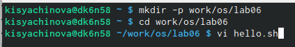{ #fig:001 width=30% }

##

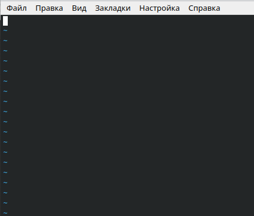{ #fig:002 width=30% }

##

4. Нажимаем клавишу "i" и вводим текст, данный в лабораторной работе. (рис. [-@fig:003])

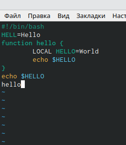{ #fig:003 width=50% }

##

5. Нажимаем "esc" для выхода и перехода в командный режим.(рис. [-@fig:004])

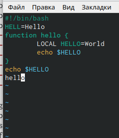{ #fig:004 width=50% }

##

6. Для перехода в режим последней строки используем ":" и внизу экрана видим, что появилось двоеточие.(рис. [-@fig:005])

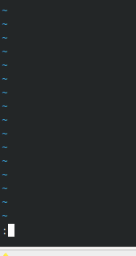{ #fig:005 width=30% }

##

7. Для записи нажимаем "w" и "q" для выхода, далее "enter" для сохранение текста и завершения работы.(рис. [-@fig:006])

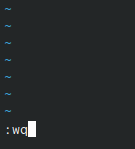{ #fig:006 width=30% }

##

8. Сделаем наш файл исполняемым. Для этого используем команду "chmod +x hello.sh". (рис. [-@fig:007])

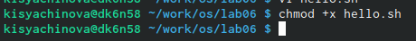{ #fig:007 width=30% }

## Задание №2

1. Вызовем vi на редактирование файла с помощью команды "vi ~/work/os/lab06/hello.sh". (рис. [-@fig:008]),(рис. [-@fig:009])

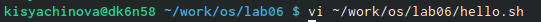{ #fig:008 width=25% }

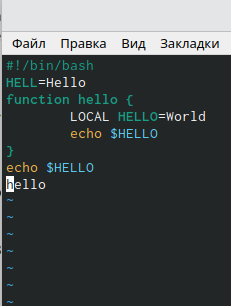{ #fig:009 width=30% }

##

2. Установим курсор в конце слова "HELL" второй строки. (рис. [-@fig:010])

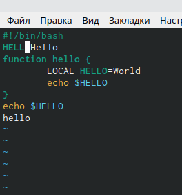{ #fig:010 width=40% }

##

3. Переходим в режим вставки с помощью "i" и заменил "HELL" на "HELLO". (рис. [-@fig:011])

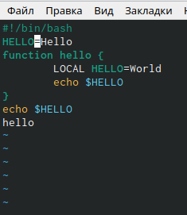{ #fig:011 width=40% }

##

4. Установим курсор на четвёртую строку и сортём слово "LOCAL", с помощью комбинации "d", "w", что означает "delete world".(рис. [-@fig:012])

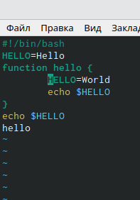{ #fig:012 width=50% }

##

5. Переходим в режим вставки и наберём текст "local". Затем, нажимаем "esc" для возврата в командный режим. (рис. [-@fig:013])

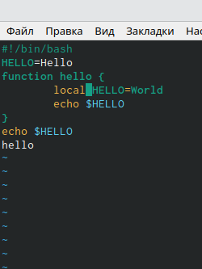{ #fig:013 width=50% }

##

6. Установим курсор на последней строке файла и вставим строку со следующим текстом: "echo $HELLO".(рис. [-@fig:014])

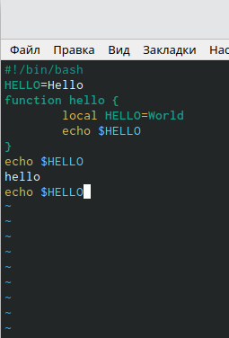{ #fig:014 width=50% }

##

7. Нажимаем "esc" для перехода в командный режим.

8. Удаляем последнюю строку используя комбинацию клавиш используя сочетание клавиш "d","d".(рис. [-@fig:015])

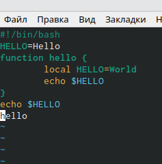{ #fig:015 width=50% }

##

9. Введём команду отмены изменение (последней команды) : "u".(рис. [-@fig:016])

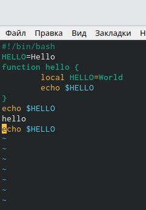{ #fig:016 width=50% }

##

10. Переходим в режим последней строки с помощью ":", записываем изменения, сохраняем и выходим в помощью "w", "q" и "enter". (рис. [-@fig:017])

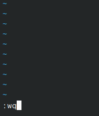{ #fig:017 width=50% }

# Выводы
В ходе выполнения данной лабораторной работы я познакомилась
с операционной системой Linux и получила практические навыки работы
с редактором vi.
