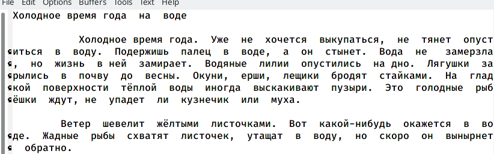

---
## Front matter
lang: ru-RU
title: Отчёт по лабораторной работе №9
author: |
	Сячинова Ксения Ивановна, НПМбд-02-21
institute: |
	Российский Университет Дружбы Народов

## Formatting
toc: false
slide_level: 2
theme: metropolis
header-includes: 
 - \metroset{progressbar=frametitle,sectionpage=progressbar,numbering=fraction}
 - '\makeatletter'
 - '\beamer@ignorenonframefalse'
 - '\makeatother'
aspectratio: 43
section-titles: true
--- 

## Цель работы

Познакомиться с операционной системой Linux.Получить практические навыки работы с редактором Emacs.

## Выполнение лабораторной работы

1. Для работы в "Emacs" необходимо установить его. Открываем его с помощью команды "emacs &".(рис. [-@fig:001])

{ #fig:001 width=50% }

##

2. Создаём файл lab07.sh с помощью комбинаций "ctrl-x","ctrl-f".(рис. [-@fig:002])

{ #fig:002 width=40% }

##

3. Напишем необходим текст. (рис. [-@fig:003])

{ #fig:003 width=40% }

##

4. Сохраняем файл с помощью комбинаций клавиш "ctrl-x", "ctrl-s"

5. Далее проделаем с файлом определённые действия 
 - 5.1. Вырезать одной командой целую строку (С-k).(рис. [-@fig:004])
 
{ #fig:004 width=30% }
 
##

 - 5.2. Вставить эту строку в конец файла (C-y).(рис. [-@fig:005])
 
{ #fig:005 width=40% }
 
##

 - 5.3. Выделить область текста (C-space).(рис. [-@fig:006])
 
{ #fig:006 width=40% }

##
 
 - 5.4. Скопировать область в буфер обмена (M-w).
 
 - 5.5. Вставить область в конец файла(рис. [-@fig:007])
 
{ #fig:007 width=30% }
 
##

 - 5.6. Вновь выделить эту область и на этотраз вырезать её (C-w).(рис. [-@fig:008])
 
{ #fig:008 width=40% }

##

 - 5.7.  Отмените последнее действие (C-/).(рис. [-@fig:009])
 
 { #fig:009 width=40% }
 
##

6. Действия с курсором.
 - 6.1. Перемещаем курсор в начало строки (С-а), (рис. [-@fig:010])
 
{ #fig:010 width=40% }

##

 - 6.2. Перемещаем курсор в конец строки (С-e), (рис. [-@fig:011])
 
{ #fig:011 width=40% }

##
 
 - 6.3. Перемещаем курсор в начало буфера (M-<), (рис. [-@fig:012])
 
{ #fig:012 width=40% }

##
 
 - 6.4. Перемещаем курсор в конец буфера (M->), (рис. [-@fig:013])

{ #fig:013 width=40% }

##

7. Управление буферами.

 - 7.1. Выведем список активных буферов на экран (C-x C-b).(рис. [-@fig:014])
 
{ #fig:014 width=40% }
 
##

 - 7.2. Переместим во вновь открытое окно (C-x o) со списком открытых буферов и переключимся на другой буфер (для этого нажмём "enter").(рис. [-@fig:015])

{ #fig:015 width=40% }

##

 - 7.3. Закроем это окно (C-x 0), (рис. [-@fig:016])

{ #fig:016 width=40% } 

##
 
 - 7.4. Теперь вновь переключимся между буферами,но уже без вывода их списка наэкран (C-x b), (рис. [-@fig:017])
  
{ #fig:017 width=40% } 

##

8. Управление окнами
 - 8.1. Поделим фрейм на 4 части: разделим фрейм на два окна по вертикали (C-x 3),а затем каждое из этих окон на две части по горизонтали (C-x 2). (рис. [-@fig:018])

{ #fig:018 width=40% } 

##

 - 8.2. В каждом из четырёх созданных окон откроем новый буфер (файл) и введём несколько строк текста. Для этого я заранее создала 4 файла с разным текстом. (рис. [-@fig:019])

{ #fig:019 width=40% } 

##

9. Режим поиска

 - 9.1. Перключимся в режим поиска (C-s) и найдём несколько слов,присутствующих в тексте.(рис. [-@fig:020])
 
{ #fig:020 width=25% } 

##
 
 - 9.2. Переключимся между результатами поиска, нажимая C-s. (рис. [-@fig:021])
 
{ #fig:021 width=40% } 

##
 
 - 9.3. Выходим из режима поиска, нажав C-g.
 
 - 9.4. Переходим в режим поиска и замены (M-%), вводим текст,который следует найти и заменить, нажмаем Enter, затем вводим текст для замены. После того как будут подсвечены результаты поиска, нажмимаем "!" для подтверждения замены. (рис. [-@fig:022]), (рис. [-@fig:023])
 
{ #fig:022 width=30% } 

##
 
{ #fig:023 width=30% } 
 
 - 9.5. Попрбуем режим поиска (M-s o). Данный поиск отличается тем, что тут считывается строка поиска, которая трактуется как регулярное выражение, и не осуществляемся поиск точно совпадения в тексте буфера. Регулярное выражение - это образец, который обозначает набор строк, возможно, и неограничнный набор.

# Выводы

В ходе выполнения данной лабораторной работы я познакомилась с операционной системой Lunix и получила практические навыки по работе с редактором Emacs.

