---
## Front matter
title: "Отчёт по лабораторной работе №9"
subtitle: "Операционные системы"
author: "Сячинова Ксения Ивановна"

## Generic otions
lang: ru-RU
toc-title: "Содержание"

## Bibliography
bibliography: bib/cite.bib
csl: pandoc/csl/gost-r-7-0-5-2008-numeric.csl

## Pdf output format
toc: true # Table of contents
toc-depth: 2
lof: true # List of figures
lot: true # List of tables
fontsize: 12pt
linestretch: 1.5
papersize: a4
documentclass: scrreprt
## I18n polyglossia
polyglossia-lang:
  name: russian
  options:
	- spelling=modern
	- babelshorthands=true
polyglossia-otherlangs:
  name: english
## I18n babel
babel-lang: russian
babel-otherlangs: english
## Fonts
mainfont: PT Serif
romanfont: PT Serif
sansfont: PT Sans
monofont: PT Mono
mainfontoptions: Ligatures=TeX
romanfontoptions: Ligatures=TeX
sansfontoptions: Ligatures=TeX,Scale=MatchLowercase
monofontoptions: Scale=MatchLowercase,Scale=0.9
## Biblatex
biblatex: true
biblio-style: "gost-numeric"
biblatexoptions:
  - parentracker=true
  - backend=biber
  - hyperref=auto
  - language=auto
  - autolang=other*
  - citestyle=gost-numeric
## Pandoc-crossref LaTeX customization
figureTitle: "Рис."
tableTitle: "Таблица"
listingTitle: "Листинг"
lofTitle: "Список иллюстраций"
lotTitle: "Список таблиц"
lolTitle: "Листинги"
## Misc options
indent: true
header-includes:
  - \usepackage{indentfirst}
  - \usepackage{float} # keep figures where there are in the text
  - \floatplacement{figure}{H} # keep figures where there are in the text
---

# Цель работы

Познакомиться с операционной системой Linux.Получить практические навыки работы с редактором Emacs.

# Выполнение лабораторной работы

1. Для работы в "Emacs" необходимо установить его. Открываем его с помощью команды "emacs &".(рис. [-@fig:001])

{ #fig:001 width=50% }

2. Создаём файл lab07.sh с помощью комбинаций "ctrl-x","ctrl-f".(рис. [-@fig:002])

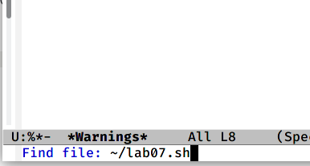{ #fig:002 width=40% }

3. Напишем необходим текст. (рис. [-@fig:003])

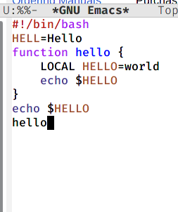{ #fig:003 width=40% }

4. Сохраняем файл с помощью комбинаций клавиш "ctrl-x", "ctrl-s"

5. Далее проделаем с файлом определённые действия 
 - 5.1. Вырезать одной командой целую строку (С-k).(рис. [-@fig:004])
 
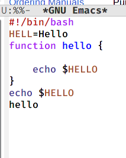{ #fig:004 width=40% }
 
 - 5.2. Вставить эту строку в конец файла (C-y).(рис. [-@fig:005])
 
{ #fig:005 width=40% }
 
 - 5.3. Выделить область текста (C-space).(рис. [-@fig:006])
 
{ #fig:006 width=40% }
 
 - 5.4. Скопировать область в буфер обмена (M-w).
 
 - 5.5. Вставить область в конец файла(рис. [-@fig:007])
 
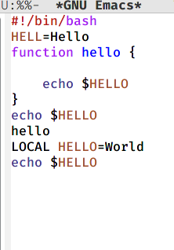{ #fig:007 width=40% }
 
 - 5.6. Вновь выделить эту область и на этотраз вырезать её (C-w).(рис. [-@fig:008])
 
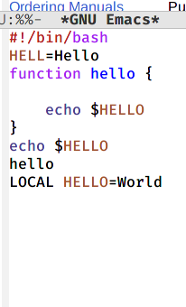{ #fig:008 width=40% }
 
 - 5.7.  Отмените последнее действие (C-/).(рис. [-@fig:009])
 
 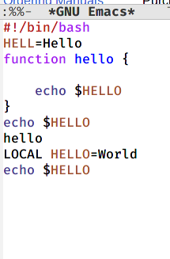{ #fig:009 width=40% }
 

6. Действия с курсором.
 - 6.1. Перемещаем курсор в начало строки (С-а), (рис. [-@fig:010])
 
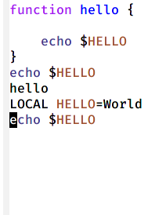{ #fig:010 width=40% }
 
 - 6.2. Перемещаем курсор в конец строки (С-e), (рис. [-@fig:011])
 
{ #fig:011 width=40% }
 
 - 6.3. Перемещаем курсор в начало буфера (M-<), (рис. [-@fig:012])
 
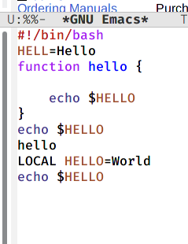{ #fig:012 width=40% }
 
 - 6.4. Перемещаем курсор в конец буфера (M->), (рис. [-@fig:013])

{ #fig:013 width=40% }

7. Управление буферами.

 - 7.1. Выведем список активных буферов на экран (C-x C-b).(рис. [-@fig:014])
 
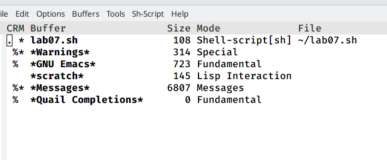{ #fig:014 width=40% }
 
 - 7.2. Переместим во вновь открытое окно (C-x o) со списком открытых буферов и переключимся на другой буфер (для этого нажмём "enter").(рис. [-@fig:015])

{ #fig:015 width=40% }

 - 7.3. Закроем это окно (C-x 0), (рис. [-@fig:016])

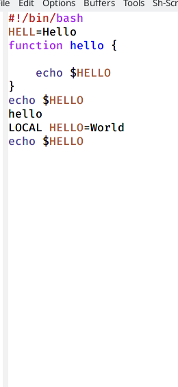{ #fig:016 width=40% } 
 
 - 7.4. Теперь вновь переключимся между буферами,но уже без вывода их списка наэкран (C-x b), (рис. [-@fig:017])
  
{ #fig:017 width=40% } 

8. Управление окнами
 - 8.1. Поделим фрейм на 4 части: разделим фрейм на два окна по вертикали (C-x 3),а затем каждое из этих окон на две части по горизонтали (C-x 2). (рис. [-@fig:018])

{ #fig:018 width=40% } 

 - 8.2. В каждом из четырёх созданных окон откроем новый буфер (файл) и введём несколько строк текста. Для этого я заранее создала 4 файла с разным текстом. (рис. [-@fig:019])

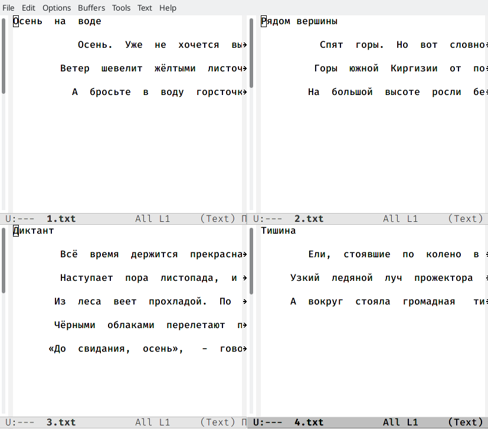{ #fig:019 width=40% } 

9. Режим поиска

 - 9.1. Перключимся в режим поиска (C-s) и найдём несколько слов,присутствующих в тексте.(рис. [-@fig:020])
 
{ #fig:020 width=40% } 
 
 - 9.2. Переключимся между результатами поиска, нажимая C-s. (рис. [-@fig:021])
 
{ #fig:021 width=40% } 
 
 - 9.3. Выходим из режима поиска, нажав C-g.
 
 - 9.4. Переходим в режим поиска и замены (M-%), вводим текст,который следует найти и заменить, нажмаем Enter, затем вводим текст для замены. После того как будут подсвечены результаты поиска, нажмимаем "!" для подтверждения замены. (рис. [-@fig:022]), (рис. [-@fig:023])
 
{ #fig:022 width=40% } 
 
{ #fig:023 width=40% } 
 
 - 9.5. Попрбуем режим поиска (M-s o). Данный поиск отличается тем, что тут считывается строка поиска, которая трактуется как регулярное выражение, и не осуществляемся поиск точно совпадения в тексте буфера. Регулярное выражение - это образец, который обозначает набор строк, возможно, и неограничнный набор.

# Ответы на контрольные вопросы.

1. Emacs − один из наиболее мощных и широко распространённых
редакторов,
используемых
в
мире
Unix.
По
популярности
он
соперничает с редактором vi и его клонами. В зависимости от ситуации,
Emacs может быть:
- текстовым редактором;
- программой для чтения почты и новостей Usenet;
- интегрированной средой разработки (IDE);
- операционной системой и т.д.
Всё это разнообразие достигается благодаря архитектуре Emacs,
которая позволяет расширять возможности редактора при помощи
языка Emacs Lisp. На языке C написаны лишь самые базовые и
низкоуровневые
части
Emacs,
включая
полнофункциональный интерпретатор языка Lisp. Таким образом, Emacs имеет встроенный
язык программирования, который может использоваться для настройки,
расширения и изменения поведения редактора. В действительности,
большая часть того редактора, с которым пользователи Emacs работают
в наши дни, написана на языке Lisp.
2. Основную трудность для новичков при освоении данного редактора
могут составлять большое количество команд, комбинаций клавиш,
которые не получится все запомнить с первого раза и поэтоу придется
часто обращаться к справочным материалам.
3. Буфер – это объект, представляющий собой текст. Если имеется
несколько буферов, то редактировать можно только один. Обычно буфер
считывает данные из файла или записывает в файл данные из буфера.
Окно – это область экрана, отображающая буфер. При запуске редактора
отображается одно окно, но при обращении к некоторым функциям
могут открыться дополнительные окна. Окна Emacs и окна графической
среды X Window – разные вещи. Одно окно X Window может быть
разбито на несколько окон в смысле Emacs, в каждом из которых
отображается отдельный буфер.
4. Да, можно.
5. При запуске Emacs по умолчанию создаются следующие буферы:
- «scratch» (буфер для несохраненного текста)
- «Messages» (журнал ошибок, включающий также информацию,
которая появляется в области EchoArea)
- «GNU Emacs» (справочный буфер о редакторе)
6. C-c | сначала, удерживая «ctrl», нажимаю «c», после – отпускаю обе
клавиши и нажимаю «|»
C-c C-| сначала, удерживая «ctrl», нажимаю «с», после – отпускаю обе
клавиши и, удерживая «ctrl», нажимаю «|»
7. Чтобы поделить окно на две части необходимо воспользоваться
комбинацией «Ctrl-x 3» (по вертикали) или «Ctrl-x 2» (по горизонтали).
8. Настройки Emacs хранятся в файле .emacs.
9. По умолчанию клавиша «←» удаляет символ перед курсором, но в
редакторе её можно переназначить. Для этого необхдимо изменить
конфигурацию файла .emacs.
10. Более удобным я считаю редактор emacs, потому что в нем проще
открывать другие файлы, можно использовать сразу несколько окон, нет
«Командного режима», «Режима ввода», «Режима командной строки»,
которые являются немного непривычными и в какой-то степени
неудобными.

# Выводы

В ходе выполнения данной лабораторной работы я познакомилась с операционной системой Lunix и получила практические навыки по работе с редактором Emacs.
