---
## Front matter
lang: ru-RU
title: Презентация по лабораторной работе №10
author: |
	Сячинова Ксения Ивановна НПМбд-02-21
institute: |
	Российский Университет Дружбы Народов

## Formatting
toc: false
slide_level: 2
theme: metropolis
header-includes: 
 - \metroset{progressbar=frametitle,sectionpage=progressbar,numbering=fraction}
 - '\makeatletter'
 - '\beamer@ignorenonframefalse'
 - '\makeatother'
aspectratio: 43
section-titles: true
---

# Цель работы

Изучить основы программирования в оболочке ОС UNIX/Linux. Научиться писать небольшие командные файлы.

# Выполнение лабораторной работы

1. Первым делом изучим команды архивации. Для этого будем использовать команды "man zip", "man bzip2", "man tar".  (рис. [-@fig:001]), (рис. [-@fig:002]), (рис. [-@fig:003]), (рис. [-@fig:004])

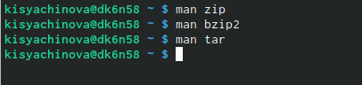{ #fig:001 width=60% }

##

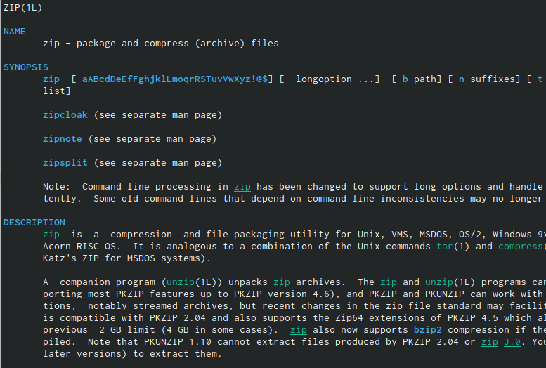{ #fig:002 width=40% }

##

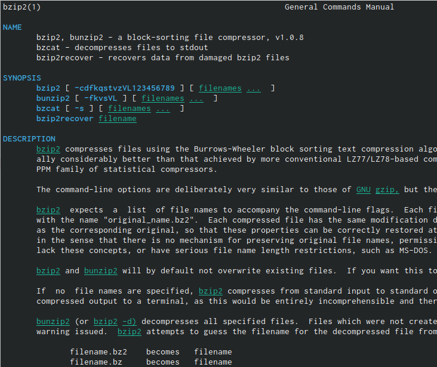{ #fig:003 width=40% }

##

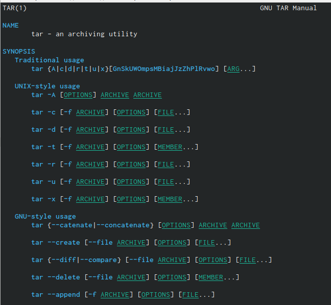{ #fig:004 width=40% }

##

После этого создадим файл, в котором будет напиан скрипт, откроем его с помощью редактора "emacs" (сочетания клавиш "ctrl-x", "ctrl-f")(рис. [-@fig:005])

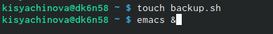{ #fig:005 width=60% }

##

Затем, создадим скрип, который при запуске будет делать резервную копию самого себя (т.е. файла, в котором содержится его исходный код) в другую директорию backup в нашем домашнем каталоге. При написании скрипта я буду использовать архиватор "bzip2".(рис. [-@fig:006])

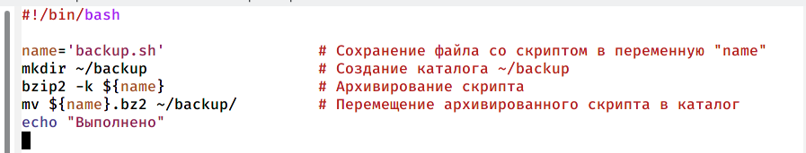{ #fig:006 width=50% }

##

Добавим право на выполнение "chmod +x *.sh" и проверим работу скрипта "./backup.sh". Также проверим, появился ли каталог backup/, переходим в него, просматриваем его содержимое, и просматриваем содержимое архива "bunzip2 -c backup.sh.bz2". (рис. [-@fig:007])

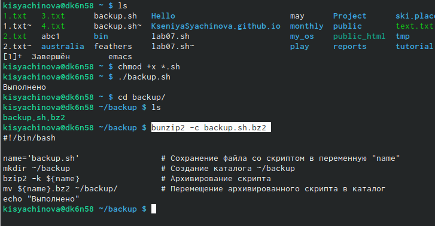{ #fig:007 width=50% }

##

2. Создадим файл для второго скрипта и откроем его в редакторе "emacs" с помощью сочетаний клавиш.(рис. [-@fig:008])

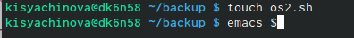{ #fig:008 width=50% }

##

Нпишем пример командного файла, который обрабатывает любое произвольное число аргументов, в том числе превышающее десять. Этот скрипт может последовательно распечатывать значения всех преданных аргументов.(рис. [-@fig:009])

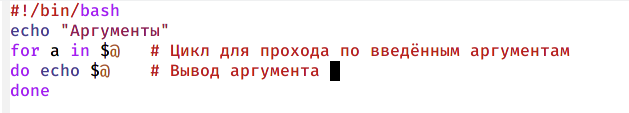{ #fig:009 width=50% }

##

После этого проверим работу написанного скрипта. Для этого спиользуем команду "./os2.sh 0 1 2 3 4 5 6 7 8 9 10 11". Но для начала добавим право на выполнение "chmod +x *.sh". Так как у нас файл, который обрабатывает любое произвольное число аргументов, я вводила аргументы, количество которых и меньше 10 и больше 10. Скрип работает верно. (рис. [-@fig:010])

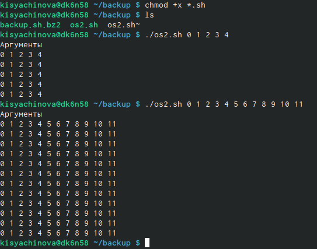{ #fig:010 width=50% }

##

3. Создаём файл для написание третьего скрипта, открываем его в "emacs".(рис. [-@fig:011])

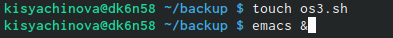{ #fig:011 width=50% }

##

Напишем командный файл, аналог команды "ls". Он должен будет выдавать информацию о нужном каталоге и выводить информация о возможностях доступа к файлам этого каталога. (рис. [-@fig:012])

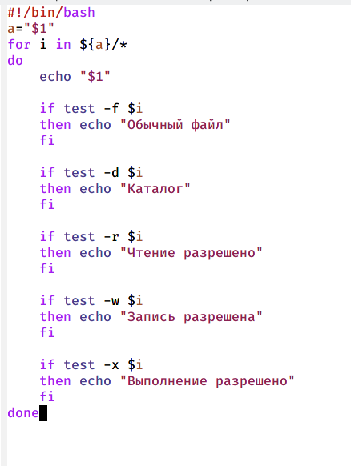{ #fig:012 width=30% }

##

Далее даём право на выполнение с помощью команды "chmod +x *.sh" и проверяем работу скрипта "./os3.sh ~". (рис. [-@fig:013]). Работает корректно. 

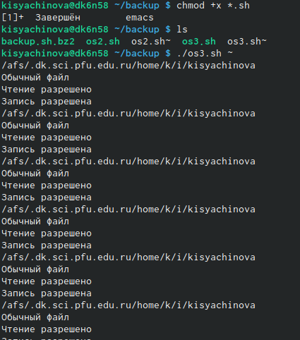{ #fig:013 width=50% }

##

4. Для выполнение третьего скрипта также создаём файл и открываем его в "emacs".(рис. [-@fig:014])

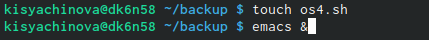{ #fig:014 width=60% }

##

Напишем командный файл для вычисление количества файлов в указанной директории. Файл полуает в качестве аргумента командной строки формат фалйа. Путь к директории также передаётся в виде аргументов командной строки. (рис. [-@fig:015])

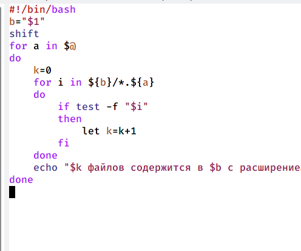{ #fig:015 width=60% }

##

Затем даём право на выполнение с помощью команды "chmod +x *.sh" и проверяем работу скрипта с помощью "./os4.sh~pdf sh txt doc". Для проверки создадим несколько файлов разного расширения. Видим, что скрипт работает верно. (рис. [-@fig:016])

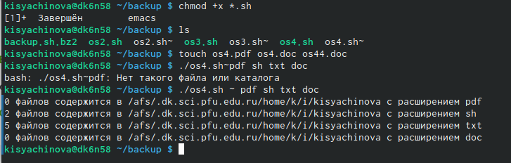{ #fig:016 width=50% }

# Выводы

В ходе выполнения данной лабораторной работы я изучила основы программирования в оболочке OC UNIX/Linux и научилась писать разные командные файлы.
