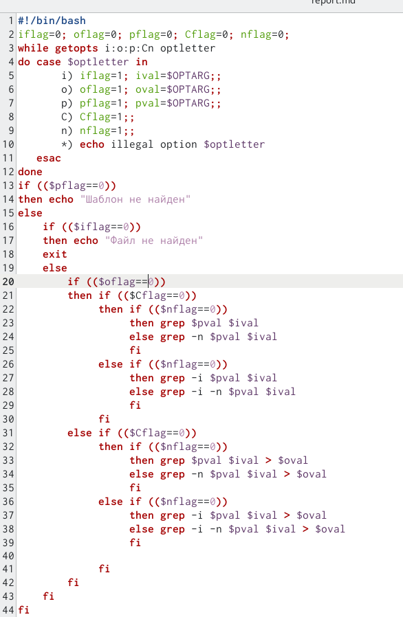
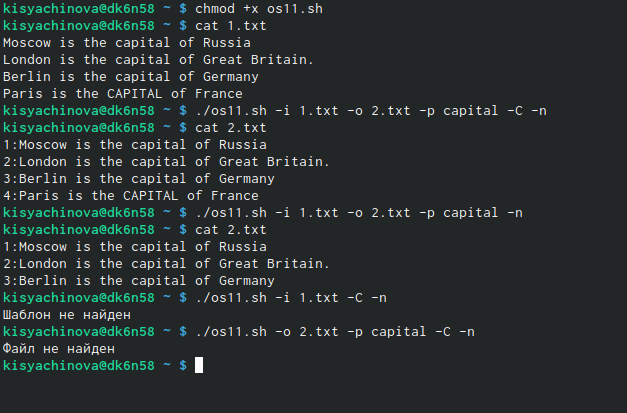
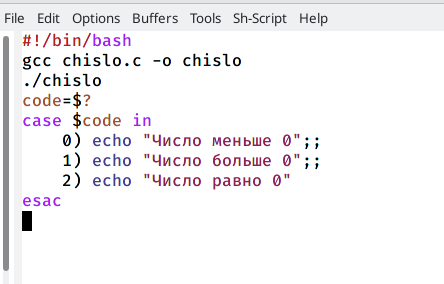
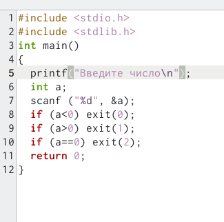
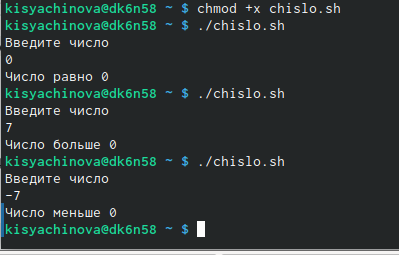
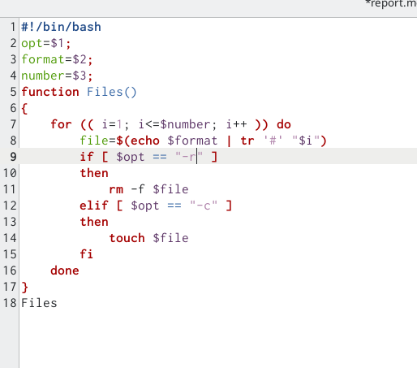
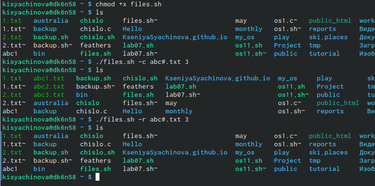
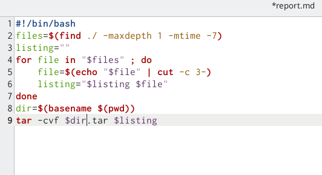
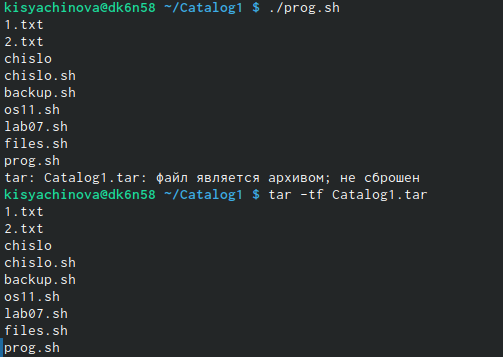

---
## Front matter
lang: ru-RU
title: Презентация к лабораторной работе №11
author: |
	Сячинова Ксения Ивановна
institute: |
	Росийский универисес дружбы народов

## Formatting
toc: false
slide_level: 2
theme: metropolis
header-includes: 
 - \metroset{progressbar=frametitle,sectionpage=progressbar,numbering=fraction}
 - '\makeatletter'
 - '\beamer@ignorenonframefalse'
 - '\makeatother'
aspectratio: 43
section-titles: true
---

# Цель работы

Изучить основы программирования в оболочке ОС UNIX. Научится писать более сложные командные файлы с использованием логических управляющих конструкцийи циклов.

# Выполнение лабораторной работы

1. Используя команды getopts grep,напишем командный файл, который анализирует командную строку с ключами:(рис. [-@fig:001])
- -iinputfile — прочитать данные из указанного файла;
- -ooutputfile — вывести данные в указанный файл;
- -pшаблон—указать шаблон для поиска; 
- -C — различать большие и малые буквы; 
- -n—выдавать номера строк.

{ #fig:001 width=25% }

##

После этого, проверяем работу написанного скрипта, используя различные опции. Но перед этим добавим право на исполнение файла "chmod +x os11.sh". Перед этим создадим два файла, в один из которых запишем текст. С ним и будем проверять выполнение программы. Используем разные команды "./os11.sh -i 1.txt -o 2.txt -p capital -C -n","./os11.sh -i 1.txt -o 2.txt -p capital -n" и т.д. (рис. [-@fig:002])

{ #fig:002 width=30% }

##

2. Напишем на языке Си программу, которая вводит число и определяет, являетсяли оно больше нуля, меньше нуля или равно нулю. Эта программа будет завершается с помощью функции exit(n), передавая информацию в о коде завершения в оболочку. Командный файл будет вызывать эту программу и, проанализировав с помощью команды "$?", выдать сообщение о том, какое число было введено. Создадим два файла: chislo.c и chislo.sh.(рис. [-@fig:003]).(рис. [-@fig:004])

##

{ #fig:003 width=40% }

##

{ #fig:004 width=40% }

##

Проверим выполнение работы, даём разрешение. Всё работает верно. (рис. [-@fig:005])

{ #fig:005 width=50% }

##

3. Напишем командный файл, создающий указанное число файлов, пронумерованных последовательно от 1 до N (например1.tmp,2.tmp,3.tmp,4.tmp и т.д.).Число файлов, которые необходимо создать, передаётся в аргументы командной строки. Этот же командный файл должен уметь удалять все созданные им файлы (если они существуют). Создаём новый файл: fiels.sh.(рис. [-@fig:006])

{ #fig:006 width=50% }

##

Проверяем работу, Добавляем право на выполнение. Затем создаём три файла "./files.sh -c abc#.txt 3", затем удаляем их с помощью команды "./files.sh -r abc#.txt 3".(рис. [-@fig:007])

{ #fig:007 width=50% }

##

4. Напишем командный файл, который с помощью команды "tar" запаковывает в архив все файлы в указанной директории. Модифицировать его так, чтобы запаковывались только те файлы, которые были изменены менее недели тому назад (использовать команду find). Создаю файл prog.sh и пишу скрипт.(рис. [-@fig:008])

{ #fig:008 width=40% }

##

Далее для проверки разрешаем право на исполнение и с помощью команд "./prog.sh", "tar -tf Catalog1.tar" проверяем работу скрипта. Файлы, которые были измененны более недели назад, не были заархивированны. 
(рис. [-@fig:009])

{ #fig:009 width=40% }

## Выводы

В ходе выполнения данной лабораторной работы я изучила основы программирования в оболочке OC UNIX и научилась писать более сложные командные фалйы с использованием логических конструкций и циклов.
