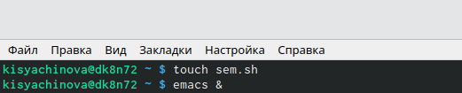
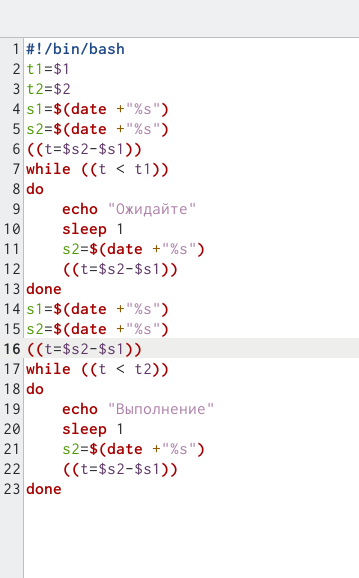
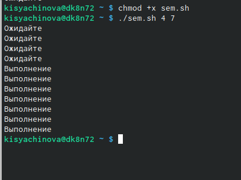
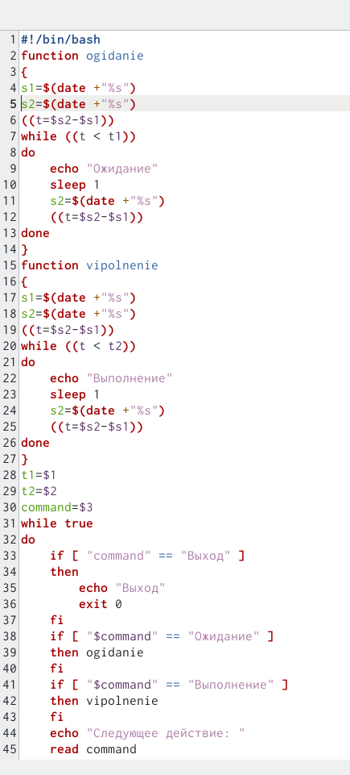
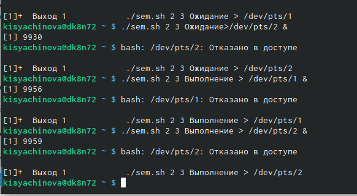
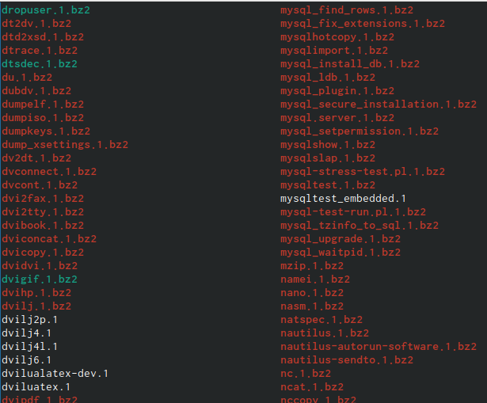
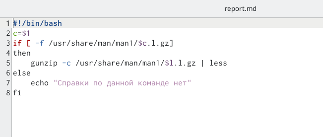
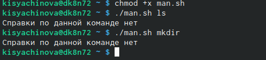
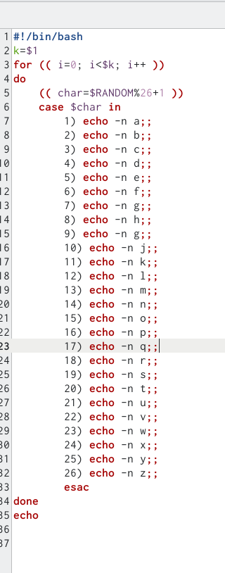
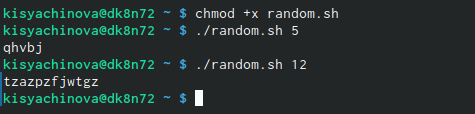

---
## Front matter
lang: ru-RU
title: Презентация по лабораторной работе №12
author: |
	Сячинова Ксения Ивановна, НПМбд-02-21
institute: |
	Российский Университет Дружбы Народов

## Formatting
toc: false
slide_level: 2
theme: metropolis
header-includes: 
 - \metroset{progressbar=frametitle,sectionpage=progressbar,numbering=fraction}
 - '\makeatletter'
 - '\beamer@ignorenonframefalse'
 - '\makeatother'
aspectratio: 43
section-titles: true
---
# Цель работы

Изучить основы программирования в оболочке ОС UNIX. Научиться писать более сложные командные файлы с использованием логических управляющих конструкцийи циклов.

# Выполнение лабораторной работы

1. Напишем командный файл, реализующий упрощённый механизм семафоров. Командный файл должен будет в течение некоторого времени (t1) дожидаться освобождения ресурса, выдавая об этом сообщение, а дождавшись его освобождения, использовать его в течение некоторого времени (t2<>t1), также выдавая информацию о том, что ресурс используется соответствующим командным файлом (процессом). Для этого создадим файл: sem.sh и напишем скрипт.  (рис. [-@fig:001]), (рис. [-@fig:002])

{ #fig:001 width=50% }

##

{ #fig:002 width=30% }

##

Далее проверим работу написанного скрипта с помощью команды "./sem.sh 4 7", но перед этим добавим право на выполнение командой "chmod +x sem.sh". Скрипт работает верно. (рис. [-@fig:003])

{ #fig:003 width=30% }

##

Далее изменим скрипт так, чтобы его можно было выполнять в нескольких термиалах.(рис. [-@fig:004])

{ #fig:004 width=25% }

##

Проверим работу с помощью комманды "./sem.sh 2 3 Ожидание>/dev/pts/1 &". Проверить работа данного скрипта не удалось, так как было отказано в доступе.(рис. [-@fig:005])

{ #fig:005 width=50% }

##

2. Реализуем команду (man с) помощью командного файла. Изучим содержимое каталога /usr/share/man/man1. В нем находятся архивы текстовых файлов, содержащих справку по большинству установленных в системе программ и команд. Каждый архив можно открыть командой less сразу же просмотрев содержимое справки. Командный файл должен получать в виде аргумента командной строки название команды и в виде результата выдавать справку об этой команде или сообщение об отсутствии справки, если соответствующего файла нет в каталоге man1.(рис. [-@fig:006])

{ #fig:006 width=30% }

##

Далее я создала файл "man.sh", в котором буду писать следйющий скрипт. (рис. [-@fig:007])

{ #fig:007 width=50% }

##

Проверим работу скрипта, дадим ему право на выполнение "chmod +x man.sh" и проверим с помощью команды "./man.sh ls", "./man.sh mkdir"(рис. [-@fig:008])

{ #fig:008 width=50% }

##

3. Используем встроенную переменную $RANDOM, напишем командный файл, генерирующий случайную последовательность букв латинского алфавита. Учтём, что $RANDOM выдаёт псевдослучайные числа в диапазоне от 0 до 32767. Создадим файл для напсиания тертьего скрипта (random.sh).(рис. [-@fig:009])

{ #fig:009 width=20% }

##

Затем даём право на выполнение и с помощью команды "./random 5" и "./random 12" проверяем выполнение работы.(рис. [-@fig:010])

{ #fig:010 width=50% }

# Выводы

В ходе выполнение данной лабораторной работы я изучила основы программирования в оболочке OC UNIX и научилась писать более сложные командные файлы с использованием логических управляющих конструкций и циклов.
