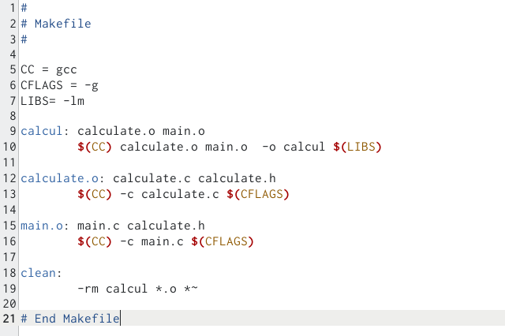

---
## Front matter
lang: ru-RU
title: Презентация по лабораторной работе №13
author: |
	Сячинова Ксения Ивановна, НПМбд-02-21
institute: |
	Российский Университет Дружбы Народов
## Formatting
toc: false
slide_level: 2
theme: metropolis
header-includes: 
 - \metroset{progressbar=frametitle,sectionpage=progressbar,numbering=fraction}
 - '\makeatletter'
 - '\beamer@ignorenonframefalse'
 - '\makeatother'
aspectratio: 43
section-titles: true
---

## Цель работы

Приобрести простейшие навыки разработки, анализа, тестирования и отладки приложений в ОС типа UNIX/Linux на примере создания на языке программирования С калькулятора с простейшими функциями.

## Выполнение лабораторной работы

1. В домашнем каталоге создаём подкатолог ~/work/os/lab_prog с помощью команды "mkdir -p".(рис. [-@fig:001])

{ #fig:001 width=60% }

##

2. Затем перейдём в каталог и создадим файлы: calculate.h, calculate.c, main.c. Делаю это с помощью команды "touch".(рис. [-@fig:002])

{ #fig:002 width=60% }

##

Создадим примитинейший калькулятор, способный складывать, вычитать, умножать и делить, возводить число в степень, брать квадратный корень, вычислять sin,cos,tan. При запуске он будет запрашивать первое число, операцию, второе число. После этого программа выведет результат и остановится. Реализация функций калькулятора будет делать в файле calculate.c.(рис. [-@fig:003]),(рис. [-@fig:004])

{ #fig:003 width=20% }

##

{ #fig:004 width=35% }

##

Интерфейсный файл calculate.h, который описывает формат вызова функции калькулятора.(рис. [-@fig:005])

{ #fig:005 width=40% }

##

Основной файл main.c, реализующий интерфейс пользователя к калькулятору.(рис. [-@fig:006])

{ #fig:006 width=50% }

##

3. Выполянем компиляцию файлов посредствос "gcc".(рис. [-@fig:007])

{ #fig:007 width=50% }

4. В ходе компиляции ошибок не выявлено.

##

5. Создадим Makefile c необходимым содержанием. Он необходим для автоматической компиляции файлов calculate.c (цель calculate.o), main.c (цель main.o), а так же их объединения в один исполняемый файл calcul. Цель "clean" нужна доя автоматического удаления файлов. Переменная "CC" отвечает за утилиту для компиляции. Переменная "CFLAGS" отвечает за опции в данной утилите. Переменная LIBS отвечает за опции для объединения объектных файлов в один исполняемый файл.(рис. [-@fig:008])

{ #fig:008 width=40% }

##

6. Далее изменим файл. В переменную CFLAGS добавим "-g", которая необходима для компиляции объектных файлов и их использования в программе отладчика GDB. Также, компиляция выбирается с помощью переменной СС.(рис. [-@fig:009])

{ #fig:009 width=50% }

##

Затем выполняем компиляцию файлов с помощью команды "make".(рис. [-@fig:010])

{ #fig:010 width=50% }

##

После этого выполняем gdb отладку программмы calcul. Запускаем GDB и загружаем в него программу для отладки, используя команду "gdb ./calcul".(рис. [-@fig:011])

{ #fig:011 width=40% }

##

Далее вводим комнаду "run" для запуска программы внутри откадчика.(рис. [-@fig:012])

{ #fig:012 width=50% }

##

Для постраничего просмотра исходного кода используем команду "list". (рис. [-@fig:013])

{ #fig:013 width=35% }

##

Для просмотра строк с 12 по 15 основного файла используем команду "list 12,15".(рис. [-@fig:014])

{ #fig:014 width=50% }

##

Для просмотра определённых строк не основного файла используем команду "list calculate.c:20,29".(рис. [-@fig:015])

{ #fig:015 width=50% }

##

Для установки точки в файле "calculate.c" на строке 21 используем команды "list calculate.c:20,27" и "break 21".(рис. [-@fig:016])

{ #fig:016 width=50% }

##

Чтобы вывесни информацию об имеющихся точках останова используем команду "info breakpoint".(рис. [-@fig:017])

{ #fig:017 width=50% }

##

Запустис программу внутри отладчика и убедимся, что программа остановилась в момент прохождения точки останова. (рис. [-@fig:018])

{ #fig:018 width=50% }

##

Посмотрим, чему на этом этапе равно значение переменной Numeral, с помощью команды "print Numeral" и сравним его с результатом вывода на экарн после использования команды "display Numeral". Значения совпадают. (рис. [-@fig:019])

{ #fig:019 width=50% }

##

Уберём точки останова с помощью команды "delete 1".(рис. [-@fig:020])

{ #fig:020 width=50% }

##

7. С помощью утилиты splint проанализировала коды файлов calculate.c и main.c.(рис. [-@fig:021])(рис. [-@fig:022])

{ #fig:021 width=50% }

##

{ #fig:022 width=50% }

##

Выяснилось, что в данных файлах присутсвует функция чтения scanf, которая возвращает целое число (int). Но эти числа нигде не используются не сохраняются. Утилита выводит предупреждение о том, что в файле calculate.c происходит сравнение вещественного числа с нулём. Помимо этого, возвращаемые значения (double) в функциях pow, sqrt, sin, cos, tan записываются в перменную типа float, что говорит нам о потере данных.

## Выводы

В ходе выполнения данной лабораторной работы я приобрела простейшие навыки разработки, анализа, тестирования и отладки приложений в OC типа UNIX/Linux на примере создания на языке программирования С калькулятора с простейшими функциями.
