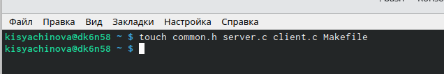
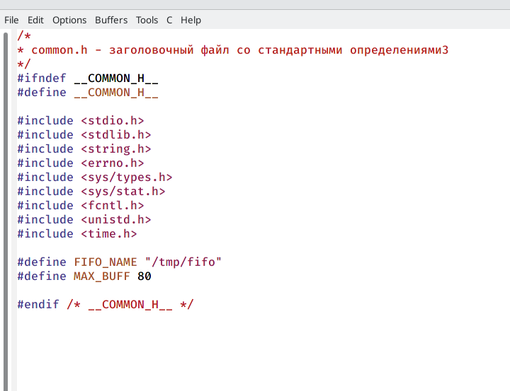
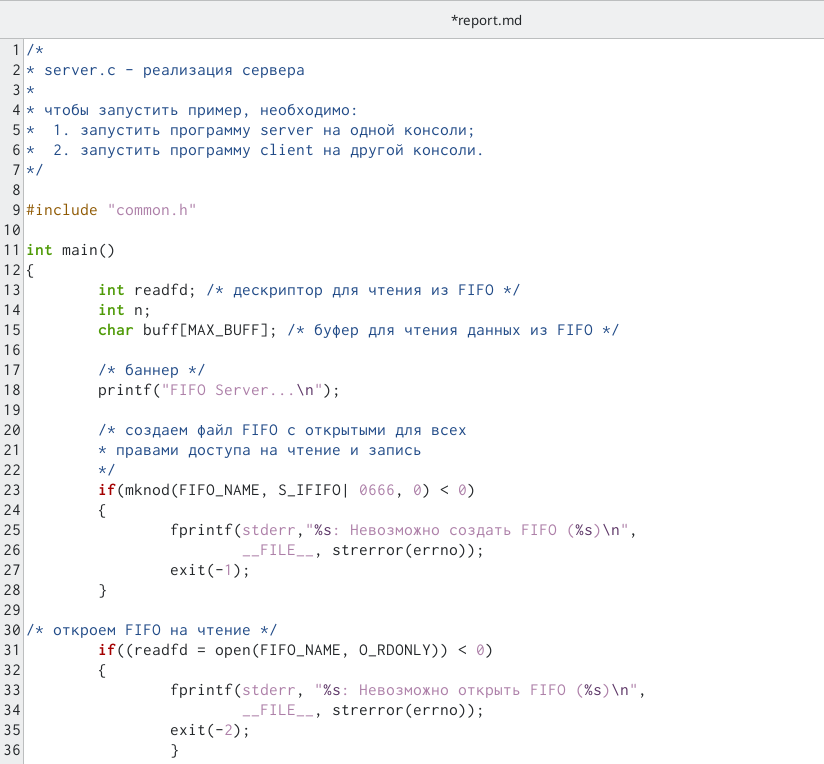
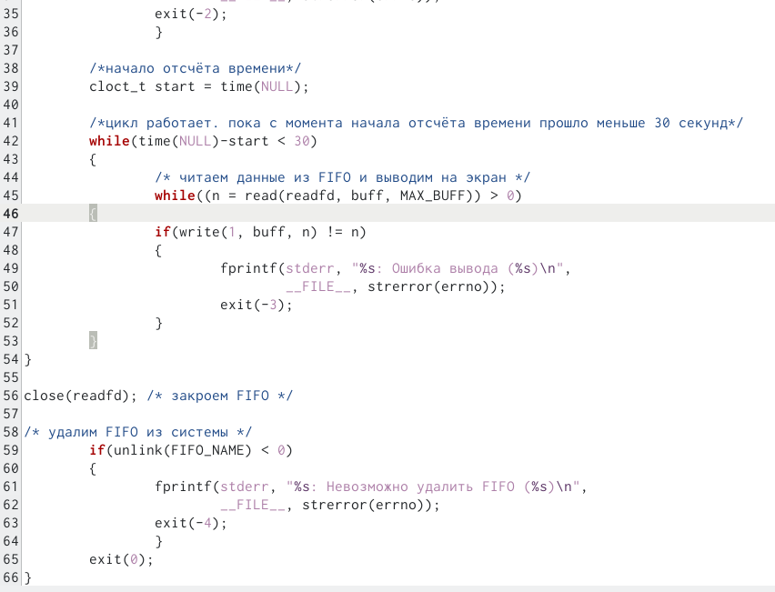
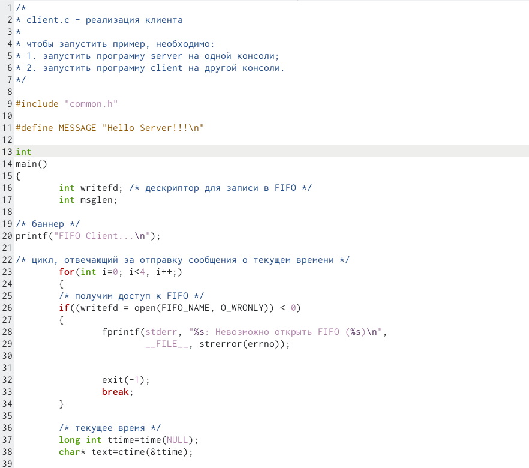
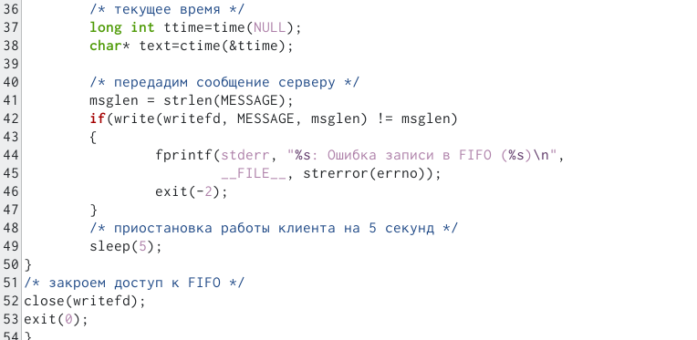
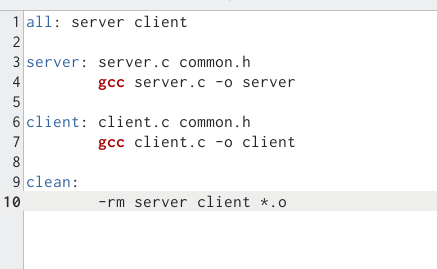
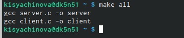
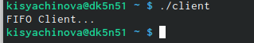
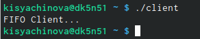

---
## Front matter
title: "Отчёт по лабораторной работе №14"
subtitle: "Операционные системы"
author: "Сячинова Ксения Ивановна"

## Generic otions
lang: ru-RU
toc-title: "Содержание"

## Bibliography
bibliography: bib/cite.bib
csl: pandoc/csl/gost-r-7-0-5-2008-numeric.csl

## Pdf output format
toc: true # Table of contents
toc-depth: 2
lof: true # List of figures
lot: true # List of tables
fontsize: 12pt
linestretch: 1.5
papersize: a4
documentclass: scrreprt
## I18n polyglossia
polyglossia-lang:
  name: russian
  options:
	- spelling=modern
	- babelshorthands=true
polyglossia-otherlangs:
  name: english
## I18n babel
babel-lang: russian
babel-otherlangs: english
## Fonts
mainfont: PT Serif
romanfont: PT Serif
sansfont: PT Sans
monofont: PT Mono
mainfontoptions: Ligatures=TeX
romanfontoptions: Ligatures=TeX
sansfontoptions: Ligatures=TeX,Scale=MatchLowercase
monofontoptions: Scale=MatchLowercase,Scale=0.9
## Biblatex
biblatex: true
biblio-style: "gost-numeric"
biblatexoptions:
  - parentracker=true
  - backend=biber
  - hyperref=auto
  - language=auto
  - autolang=other*
  - citestyle=gost-numeric
## Pandoc-crossref LaTeX customization
figureTitle: "Рис."
tableTitle: "Таблица"
listingTitle: "Листинг"
lofTitle: "Список иллюстраций"
lotTitle: "Список таблиц"
lolTitle: "Листинги"
## Misc options
indent: true
header-includes:
  - \usepackage{indentfirst}
  - \usepackage{float} # keep figures where there are in the text
  - \floatplacement{figure}{H} # keep figures where there are in the text
---

# Цель работы

Приобретение практических навыков работы с именованными каналами.

# Выполнение лабораторной работы
1. Для начала изучим приведённые в тексте программы server.c и client.c. Взяв данные примеры за образец, напишишем аналогичные программы, с некоторыми измененинями. 
Первое изменение: работает не 1 клиент, а несколько (например,два). Сперва создадим все необхоимые файлы для лабораторной работы.(рис. [-@fig:001])

{ #fig:001 width=70% }

Изменим коды программ, которые даны нам в лабораторной работе. В файл common.h добавим стандартные заголовочные файлы: "unistd.h", "time.h". Они необходимы для работы других кодов файлов. Данный файл создан в качестве заголовочного файла, чтобы в остальных программах их не прописывать каждый раз.(рис. [-@fig:002])

{ #fig:002 width=70% }

2. В файл "server.с" добавляем цикл while для контроля за временем работы сервера. Разница между текущим временем и началом работы не должна превышать 30 секунд (time(NULL) и  clock_t start=time(NULL)).(рис. [-@fig:003]), (рис. [-@fig:004])

{ #fig:003 width=40% }

{ #fig:004 width=40% }

3. В файл client.c добавляем цикл, который отвечает за количество сообщений о текущем времени (4 сообщения). С помощью команды "sleep(5)" приостанавливаем работу клиента на 5 секунд.  (рис. [-@fig:005]),  (рис. [-@fig:006])

{ #fig:005 width=40% }

{ #fig:006 width=40% }

Makefile оставили без изменений. (рис. [-@fig:007])

{ #fig:007 width=40% }

Используем команду "make all" для компиляции необходимых файлов.(рис. [-@fig:008])

{ #fig:008 width=40% }

Затем открываем три терминала для проверки работы наших файлов. В первом пишем "./server", а в остальных "./client". В результате каждый терминал вывел по 4 сообщения, а по истечение 30 секунд работа сервера была завершена. Всё работает верно. (рис. [-@fig:009]), (рис. [-@fig:010]), (рис. [-@fig:011])

{ #fig:009 width=40% }

{ #fig:010 width=40% }

{ #fig:011 width=40% }

# Выводы

В ходе выполнения данной лабораторной работы я приобрела навыки работы с очередями сообщений.
